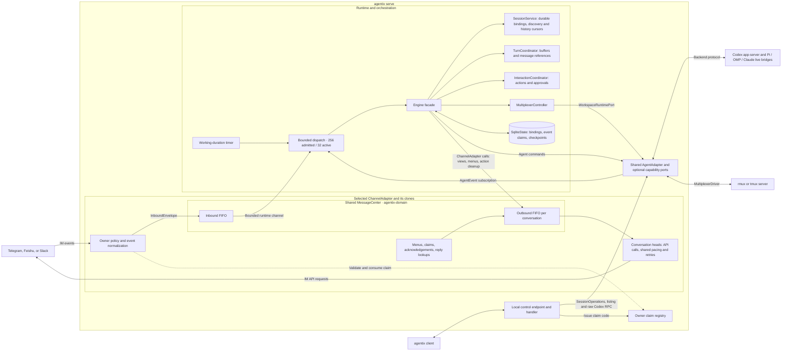
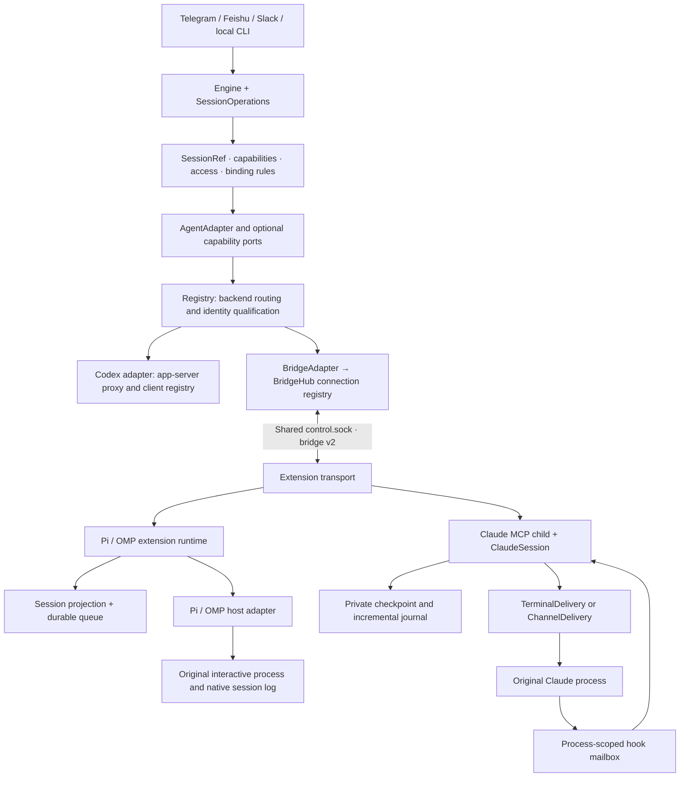
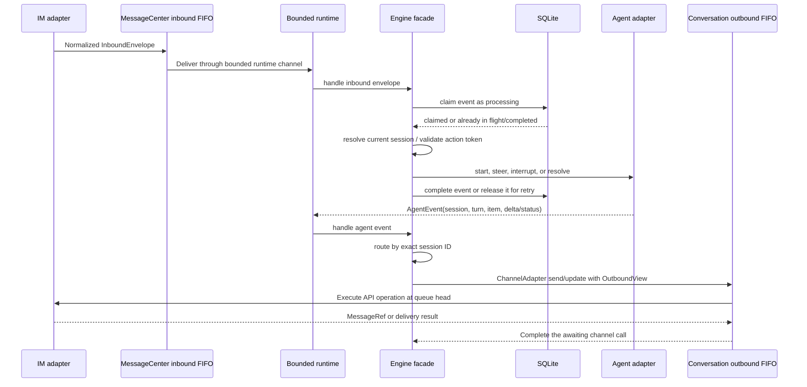
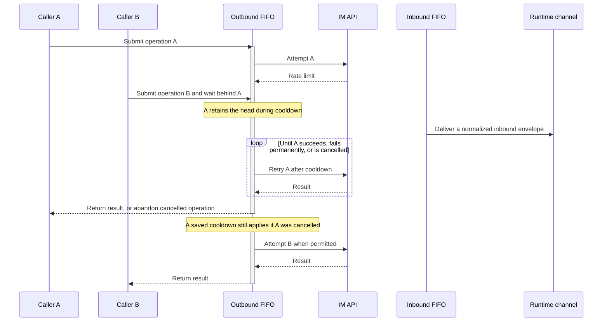

# Agentix Architecture

## 1. Overview

Agentix separates domain contracts, runtime persistence, application orchestration, and external adapters. `agentix-domain` defines identity, binding rules, views, and ports; `agentix-storage` implements runtime persistence; `agentix-core` coordinates sessions and tasks. Agent and IM crates translate external protocols through domain contracts.

The executable selects one or several backends and one IM channel from validated TOML configuration. The engine supports a collection of channel adapters, while `serve` currently assembles only the configured channel. The diagram shows logical components inside that process, not a separate task for every box. `MessageCenter` is defined in `agentix-domain` and owned by each selected channel adapter; clones share inbound admission and per-conversation outbound queues.

The local control handler runs separately from Engine dispatch and uses the shared registry for session listing and the existing Codex connection for raw requests. Its claim requests use the owner claim registry. SDK polling, connection setup, and WebSocket control frames are omitted from the application message paths shown above.

`Engine` is the orchestration facade rather than the owner of one large shared state bag. `SessionService` owns durable binding transitions, restoration, discovery, session metadata, and history cursors; `TurnCoordinator` owns active turns, render buffers, and message references; `InteractionCoordinator` owns pending interactions and scoped actions; and `MultiplexerController` isolates workspace-runtime access. `TaskBoardService` owns task input prompts, conversation recording, notification ingestion, durable outbox staging, and its consumer cursor identity. Its views use a narrow `TaskBoardUi` port for session context, scoped actions, and channel output; the service can record conversations without constructing an Engine. Engine dispatches inbox edits returned by the source poller through normal inbound validation. Pure view construction lives in `engine/presentation.rs` and has no adapter or storage dependency. The Engine entry point dispatches to focused session, workspace, turn, interaction, and startup workflow modules. These modules coordinate existing services and explicit post-commit effects; they do not introduce additional state containers. `SessionService` serializes local binding commits separately from remote subscription and IM notification I/O. Pending task, rename, and interaction replies are taken as owned values before awaiting remote operations, so their shared state locks cannot block other conversations. Engine runtime admission resolves local conversation/session resources before starting owned workers; remote operations run inside those workers.

## Layer boundaries and ownership

| Layer | Owns | Boundary |
| --- | --- | --- |
| Entrypoints | Configuration, listener lifecycle, channel/backend assembly | `agentix` wires dependencies; it does not implement host-specific turn logic |
| Application | IM orchestration and shared send/stop/history/command policy | `SessionOperations` is used by CLI and Engine; raw Codex `call` remains an explicit diagnostic escape hatch |
| Domain | Qualified identity, access, capabilities, bindings, action/turn/session coordination | Host display names never determine permission; `SessionAccess` distinguishes writable, read-only reasons, and offline |
| Routing | Backend selection, native/public ID conversion, backend event forwarding | `SessionRef` contains an `AgentKind` and opaque `NativeSessionId`; string `SessionId` remains at compatibility and persistence boundaries |
| Agent adapters | Wire/domain conversion, host-specific capabilities and optional ports | Generated wire DTOs stay in `agentix-bridge`; explicit conversions produce core types |
| Native connection ownership | Registration, duplicate rejection, online connections, one resume/offline lifecycle source | `BridgeHub` is authoritative; adapters do not maintain a second connection cache |
| Extension | Original-process execution, native history projection and durable remote queue | Transport owns framing/reconnect; runtime coordinates; session owns turn association/history; queue owns receipts/replay; host adapter owns Pi/OMP API differences |
| Claude plugin | Hook mailbox, observed turns, delivery receipts, terminal or Channel input | MCP tools and Channel capability are exposed only in Channel mode; hooks and delivery adapters own Claude-specific behavior |
| Infrastructure | SQLite state, channel transport, rmux SDK and native session storage | Pi/OMP queue records remain in native logs; Claude keeps a private checkpoint and incremental journal; Agentix SQLite stores IM bindings and coordination state |

The registry does not poll every backend for lifecycle changes. Adapters publish them: the Codex adapter observes its client registry and transport lifecycle, deferred adapters retry unavailable backends, and BridgeHub owns native connection lifecycle. On event broadcast lag, Engine invalidates stale actions and reconciles history for active bindings.

Control requests use the shared bounded `DispatchQueue`: at most 256 admitted requests, including at most 32 active workers. Mutations preserve per-session order; history and stop have independent lanes so they remain available while a native prompt awaits acknowledgment. Backend-qualified identities and legacy aliases reserve the same session resource. A raw Codex call acquires exclusive access to the Codex backend, while ordinary requests share that backend resource and retain their individual session ordering. It does not fence other backends. The runtime owns its workers and cancels them on shutdown; the queue itself never spawns detached work. The Engine runtime uses the same admission primitive for inbound requests, agent events, recovery, and periodic work.

Native list queries fetch `SessionInfo` with at most 16 concurrent RPCs instead of copying history and queue snapshots. Pi/OMP index a stable native branch once and invalidates it on leaf/activity/association changes. Queue logs append mutations rather than repeatedly serializing all receipts. Pi/OMP `stop` and metadata/history/queue reads can bypass a pending extension command, while other mutations remain serialized. Claude has no remote stop or FIFO submission; its pending delivery receipt guards concurrent prompt requests while hooks and reads remain responsive. These optimizations preserve state ownership; measured limits and component-level results are in [performance](performance.md).

The Rust generic bridge crate and the Node `plugins/agentix-bridge` package serve different sides of the same protocol. The unused legacy subprocess RPC implementation has been removed. Adding a new live host should extend the generic bridge path, following [the host protocol](host-protocol.md), without adding host-name branches to Engine.

Adapters depend on `agentix-domain`, never on the application or runtime storage.
`agentix-core` composes domain contracts and `agentix-storage`; the latter owns all
runtime SQL. Startup qualifies persisted identities from the registry's backend
list, so `AgentAdapter` no longer accepts a SQLite implementation.
[Architecture tests](../crates/agentix/tests/architecture.rs) enforce these
production dependency boundaries. Adapter integration tests may depend on the
application explicitly to verify a complete use case.

## 2. Crates

| Crate | Responsibility |
| --- | --- |
| `agentix-domain` | host-independent identity, capabilities, adapter contracts, view data and shared channel primitives |
| `agentix-storage` | SQLite bindings/checkpoints and disposable serialized turn cache; no application or host dependency |
| `agentix-core` | application coordinators, command parsing, session policy, routing and rendering orchestration |
| `agentix-codex` | app-server protocol, native WebSocket-over-UDS client, history fallback, reconnect/resubscribe |
| `agentix-bridge` | generic native extension protocol, connection ownership, RPC correlation, event conversion, and live adapter |
| `agentix-multiplexer` | shared driver contract, validation, inventory hierarchy and workspace manager |
| `agentix-rmux` | typed rmux SDK driver |
| `agentix-tmux` | bounded tmux CLI driver and process ancestry mapping |
| `agentix-telegram` | owner policy, mention handling, native command menu, long polling, message edit, callback acknowledgment |
| `agentix-slack` | Socket Mode, workspace/owner policy, thread identities, Block Kit messages and callbacks, edited Inbox events, bounded API retries, Slack CLI startup manifest synchronization |
| `agentix-feishu` | owner policy, long connection, Card JSON 2.0 send/edit, dynamic command cards, reply-context lookup, card callbacks |
| `agentix` | config, dependency assembly, lifecycle, local control transport, `serve`, `doctor`, and the diagnostic CLI client |
| `agentix-task` | independent SQLite Projects/Jobs/Tasks/Plans, leases, dependencies, events, and document projection |
| `taskix` | standalone task commands and host-hook interface over `agentix-task` |

## 3. Canonical data flow

Inbound delivery and each conversation’s outbound FIFO progress independently. In this example A and B target the same conversation: B waits behind the rate-limited head while an already-normalized inbound envelope reaches the runtime channel:

Engine workers can wait on separate conversations concurrently. Requests affecting the same conversation or session retain their order; the per-conversation outbound queues also preserve API attempt order. A Feishu reply-context lookup uses the outbound queue before normalization can finish. The queue itself does not spawn background workers; cancelling a caller drops that operation and releases its queue position.

Each IM adapter and all of its clones share a `MessageCenter`. It has one inbound FIFO and a separate outbound FIFO for each conversation; unscoped API calls share a separate queue. Tokio’s fair mutexes preserve first-poll order within each queue. The inbound head delivers to the bounded runtime channel. Each outbound head owns its operation and retries, while other conversations may perform I/O concurrently. Weak queue references are pruned as operations enter, so idle conversation queues do not accumulate. Work stays in caller futures with no detached retry workers. Dropping a future abandons its queue position; established transport cooldowns remain in shared adapter state. No global queue or rate-state lock is held across HTTP I/O. A server-directed cooldown delays new attempts across all conversations; requests already in flight may still finish.

The center covers all Agentix-owned IM API paths: sends, edits, action cleanup, command menus, owner-claim replies, Telegram bot initialization and callback acknowledgements, and Feishu reply-context lookups. SDK polling, connection bootstrap, heartbeats, and WebSocket frame acknowledgements remain transport mechanics outside the application queues. Inbound delivery is independent of outbound pacing; a Telegram callback can reach the runtime while its acknowledgement waits. A Feishu prompt that requires a reply-context lookup must finish that queued lookup before its normalized envelope is ready.

The main Engine dispatcher owns one admission loop and at most 32 workers, with a total capacity of 256 pending plus active operations. Intake pauses at global capacity, retaining upstream backpressure. Each conversation may have at most 16 unfinished inbound requests. Further requests are durably rejected and produce coalesced Session busy notices; accepted requests retain FIFO order and rejected IDs cannot execute on replay. Pending duplicate IDs do not consume another slot. Scope resolution uses a fresh local binding/action snapshot when pending work has an available worker; idle and worker-saturated iterations skip snapshot allocation. Attach reserves the old session, target session, and displaced conversation; opaque buttons receive the same reservations without consuming or authorizing their tokens. Backend-qualified IDs and legacy aliases intersect. Fork, clear, and workspace mutations fence the affected backend because replacement session IDs are not known until the host replies. Unrelated backends remain runnable. Connection-wide invalidation and broadcast-gap recovery use an explicit global barrier.

Working-duration refreshes are individual session operations and are coalesced while pending or active. Stable round-robin admission prevents a large active set from repeatedly excluding later sessions. Task-board refresh has one coalesced ingestion consumer. It atomically stages notifications and advances its cursor in runtime SQLite, without sending IM requests. A separate pool of up to 32 owned delivery workers leases only each consumer’s oldest notification in each conversation. Slow sends and retries do not block ingestion or delivery to other conversations. Task and admission-notice consumers share this pool with alternating priority. Each send has a 20-second deadline; 60-second leases recover interrupted workers, and failures retry with exponential delays of 1–256 seconds. A send acknowledged by IM but not yet committed locally may be repeated after a crash. Legacy taskix consumer cursors are imported once. Inbox source polling runs independently, and detected edits re-enter the same bounded inbound scheduler.

Shutdown stops admission, gives active workers one second to settle, then aborts and joins the remainder. Requests still in the pending queue never claim their event IDs. Interrupted in-flight requests whose outcome is unknown are stored as `uncertain`; restart does not automatically replay them. Completed requests remain completed, and explicitly failed requests retain their retry semantics. Worker panics stop the service because a partially applied application transition cannot safely be assumed recoverable. After workers stop, shutdown preparation checkpoints SQLite, invalidates actions, and detaches every live route before performing any IM I/O. Owned notification plans then run with at most 32 concurrent deliveries and one shared deadline; an unreachable conversation cannot prevent another conversation from receiving its notice or keep the service alive indefinitely.

`agentix reload` uses the same local control endpoint and a server-owned configuration path. Its supervisor prepares a configuration snapshot and validates changed channel credentials while the current service runs. Engine and control dispatch queues, workers, notification delivery, source polling, and unchanged event subscriptions survive the switch. Engine snapshots share live session, turn, interaction, and task-input coordination state, so in-flight work can finish without restoring or detaching bindings. Matching IM and backend adapters are reused; owners are updated on the existing channel policy. Only changed IM receivers are handed off, using the persistent inbound queue. Failed preparation or credential validation leaves the old service untouched. Listener, storage, logging, existing Codex transport, and bot identity changes require restart. See [configuration reload](development-and-operations.md#reloading-configuration) for connection-handoff limits.

`ConversationRef` consists of channel kind and channel-native conversation ID. `SessionId` is opaque; `SessionKey` encodes the backend and native ID at the registry boundary. Multiple configured adapters can therefore expose identical native IDs without sharing binding, action, history, or dispatch state.

Attachment, startup, and shutdown menu synchronization uses `ChannelAdapter::sync_command_menu`, whose contract forbids sending chat messages and defaults to no operation. Telegram implements it by updating native command metadata; Feishu and Slack inherit the default. Interactive menu presentation continues to use `set_command_menu`. The engine builds the shared command catalog and delegates both operations without selecting platform behavior.

At startup, each configured channel adapter supplies its stable, non-secret bot identity before durable routes are restored. SQLite's `channel_identities` table associates all routing state for a channel with its configured bot (one bot per channel). A changed or unknown identity atomically invalidates that channel's bindings, message views, interactions, deduplication records, and notification outbox, while retaining monotonic binding epochs and notification cursors. Identity resolution belongs to adapters; reconciliation and restoration use the shared domain contract. See [changing the configured bot](usage.md#changing-the-configured-bot).

## 4. Binding state machine

The in-memory `BindingTable` has three indexes:

- `by_conversation`: current session for a chat
- `by_session`: current chat for a session
- `draining`: previous active sessions still allowed to deliver critical events

SQLite enforces the same one-to-one current mapping with a primary key on conversation and a unique constraint on session ID. Binding epochs increment on attach/detach and provide a durable invalidation boundary. The persisted epoch is authoritative: startup restoration and every subsequent attach copy it into the in-memory binding table, so repeated restarts cannot reset or desynchronize the epoch.

Attach and detach use a state/effect boundary. The SQLite transition is committed first, then the in-memory coordinator is updated. Subscription cleanup, command-menu updates, and IM notifications run afterward as best-effort effects. A temporary channel failure therefore cannot roll back or misreport an attachment that is already durable.

Delivery classification:

| Route | Stream event | Interaction | Completion |
| --- | --- | --- | --- |
| Current/live | deliver | deliver | update the live turn card |
| Draining | suppress | deliver with background label | update the existing card and add Attach |
| Unbound | suppress | suppress | notify known authenticated conversations with Attach |

## 5. Turn rendering

The `/sessions` picker renders each session as a numbered quote block with a title, status indicator, and monospace workspace path. Workspace paths under the current user's Home directory are abbreviated with `~` before entering the channel adapter. Telegram disables automatic link previews on sends and edits so filesystem paths cannot create unrelated webpage cards.

Turn buffers are keyed by `(session_id, turn_id)` and accumulate user text and assistant deltas. Message references use the same key. The first visible conversation event sends a message; later visible events edit that exact message. Live turns, attach hydration, and history pages all use the same conversation layout: the user input and Markdown agent output appear in separate quoted sections under their respective headings. When attach hydration finds that the latest turn is still in progress, it restores the active-turn route, buffer, and message checkpoint, then issues a fresh owner-bound Stop action. Live headers use short turn IDs and human-readable statuses. Tool start and completion events do not trigger IM sends or edits, and history rendering omits tool summaries. Approval requests remain separate actionable views.

Completed turns and running turns superseded by a newer turn leave the hot render maps. Their text, message reference, status, and timing move to a private temporary SQLite database with a 256 KiB page-cache target. Late events restore the exact record and edit the original message; throttled late updates return their changed state to temporary storage too. Failed cache writes retain hot state for retry. Session exit removes its records, including unbound sessions, and closing the cache connection automatically deletes the temporary database. This trades temporary disk usage and per-turn I/O for bounded retention of completed-turn bodies in memory; disk usage follows retained history until cleanup. It does not add durable history or change running-turn restart checkpoints.

The Codex runtime follows proxy registry changes and reconciles every ten seconds, even when no IM session is attached. Background observation uses `thread/turns/list` with `itemsView: "notLoaded"` and falls back to `thread/read` with turns if pagination is unsupported. It never calls `thread/resume` to monitor a session: another process may already own that session's writer lock.

Explicit IM attachment first attempts `thread/resume`. An active-writer rejection falls back to a read-only attachment with full history snapshots every ten seconds, independently of background-notification settings. Observed sessions survive transport reconnects without another resume attempt and detach without an unsubscribe request. Changed snapshots produce item and turn events for the existing IM renderer; these connections expose no write controls or Stop actions. The adapter rejects session mutations locally. Other attachment or initial-history failures show an IM error and a fresh retry action before changing the durable binding. Session discovery derives activity from the latest saved turn when the app-server reports `notLoaded`; this is a history-based estimate, not live status from the owning process.

The observer pages through new terminal turns until it reaches its previous completion, then emits completed, failed, and interrupted events in execution order, preserving error details. Its initial snapshot skips historical completions predating service startup; timestamped completions since startup are still reported if they finish before discovery. Failed reads preserve the previous completion marker for retry, and a disappearing session receives a final read. Completions received over the live subscription are recorded too, so detaching before the next poll does not replay them as background notices. The mock app-server enforces per-connection subscriptions and rejects resume for externally owned writers.

A terminal event without a live or draining route is a background completion. The engine sends it only to authenticated IM conversations already known to the current process, labels it with the session title and short ID, and issues an owner- and conversation-bound Attach action. A draining completion edits the existing turn card and adds the same action. The Codex client keeps one latest completed turn ID per session. The engine likewise keeps one latest turn per session with a set of recipients already notified; a new turn replaces the previous record. Duplicate delivery of that latest turn is suppressed per conversation, including a draining event replayed after its route has been removed. Current-session completions stay on their live card and never produce the background notice. Before sending a standalone notice from either a socket or polled event, the engine checks `AgentAdapter::is_subagent(session)`. Codex identifies subagents from `source.subAgent` using a read-only `thread/read` request with `includeTurns: false`; subagents and failed source queries suppress the notice. Other adapters default to non-subagent sessions. Attached and draining turn cards bypass this check.

`notifications.background_turns` defaults to true and controls standalone completion notices in the engine. The setting is shared with the Codex monitor and updated only when a configuration reload succeeds. Disabled notices do not poll background turn metadata or fetch full turn content, and skip automatic discovery entirely when no attached sessions or pending resumes need lifecycle monitoring. Enabled notices fetch read-only history, following pages until the completed turn ID is found; they include its user input and agent response, preserving Markdown quotes. A failed or missing history read leaves the outcome notification available. `ViewStatus::Background` gives these notices and draining cards a purple Feishu header and a grey quote container, while Telegram uses a ⚫ Background marker with standard blockquotes. The textual subtitle preserves completion, failure, or interruption status independently of the background color.

For Codex, ordinary input received during an active turn uses the experimental `thread/queue/add` API instead of `turn/steer`. The server persists each input as a separate FIFO follow-up turn and emits `thread/queue/changed`; Agentix parses that notification and reads `thread/queue/list` to render `/queue` and determine the position shown in its immediate enqueue confirmation. Idle input still uses `turn/start`. Adapters that do not advertise persistent queue support retain same-turn steering.

This app-server queue is distinct from the Codex TUI's Tab queue in Codex CLI 0.153.0. The TUI stores Tab-submitted messages in process-local memory and currently ignores `thread/queue/changed`; app-server exposes no RPC for that local state. Agentix therefore cannot merge or deduplicate the two queues without a Codex protocol change. If both contain pending input when a turn completes, the TUI and app-server queue services may independently attempt to submit their respective heads, yielding back-to-back turns without a shared ordering guarantee. Terminal input injection and screen scraping are deliberately excluded because they can corrupt an existing draft, truncate long queues, and duplicate turns.

Queueing is an optional `QueuedPromptPort`; attached-session commands use `SessionControlPort`; and terminal operations use `WorkspaceRuntimePort`. `AgentAdapter` contains only operations common to every backend and exposes an `AgentCapabilities` value derived from the optional ports. The engine uses those capabilities to construct help and command menus instead of relying on backend-name checks or a growing set of support booleans.

Non-final event rendering uses the channel update interval: five seconds for Telegram, one second for Feishu, and two seconds for Slack. The engine loop ticks once per second, but working-duration refreshes share that same interval with streamed content instead of bypassing it. Buffered content and locally measured duration are refreshed even without new agent output. Timer refreshes reuse the current Stop action token; they do not create an action-invalidating race. Completion bypasses the refresh interval, flushes the accumulated text, records the final duration, and removes the turn from future ticks. Restored running turns start a fresh local measurement because upstream history does not expose a compatible monotonic start instant. Telegram sends, edits, command menus, owner-claim replies, and callback acknowledgements preserve order within each chat’s message-center queue. Pacing reservations are made under a brief shared lock, which is released before sleeping or sending HTTP requests. Request starts are spaced globally by at least 50 ms and within a chat by 1.1 seconds in private chats or 3.1 seconds in groups. A chat waiting for its pacing slot does not reserve the global lock. A 429 response stores a shared cooldown for the requested delay plus a 100 ms margin; cancelling one retry does not clear the cooldown. Completed-turn messages also respect these transport limits. Expired per-chat pacing entries are removed on subsequent requests. Telegram converts quoted sections independently to escaped MarkdownV2 before restoring their quote markers, preserving paragraph and list boundaries inside each visual block. Conversion happens before length enforcement so truncation cannot leave broken formatting delimiters.

## 6. Agent transports

### Codex

Agentix exposes a per-client proxy at `[agent.codex].proxy_endpoint`, defaulting to `~/.codex/app-server-control/app-server-control.sock`. The configured `endpoint` is the upstream, defaulting to `~/.codex/app-server-control/app-server-control-upstream.sock`. Defaults honor `CODEX_HOME`. Unix and WS frontends preserve each client's independent upstream connection, initialization, request IDs, and subscription. The stdio frontend translates JSON lines to one upstream WebSocket; shared upstreams use Unix or WS. Agentix's own initialized connection goes directly to the upstream.

If a local upstream is unavailable, Agentix starts the configured executable with `app-server --listen ENDPOINT`, after reading the effective user's login environment. The child starts in a separate process group with detached standard streams. Startup failure or cancellation terminates the newly launched child; after readiness it survives Agentix shutdown. Agentix never deletes the upstream socket, and reuses an existing listener on restart. After Agentix exits the OS adopts the child; this does not install a supervisor or automatic restart policy. The proxy endpoint belongs exclusively to Agentix; users must not start app-server on it. Unix or WS bind failures become `ProxyBindError`: `serve` logs an ERROR and exits nonzero before starting the upstream or IM channels, without entering backend retries. Existing Unix paths, including stale sockets and regular files, are preserved. Graceful shutdown removes only the proxy socket inode created by this instance.

The proxy inspects method and request ID fields before parsing tracked lifecycle messages in full, avoiding complete JSON object allocation for streamed notifications. WebSocket messages pass through unchanged. Peer identification runs in each accepted connection task rather than serializing listener acceptance.

On disconnect, Agentix's internal upstream client:

1. fails pending request waiters;
2. emits a generation-scoped disconnect event, invalidating old UI actions;
3. reconnects with exponential backoff;
4. performs a fresh initialize handshake;
5. swaps the writer and replays `thread/resume` for attached sessions;
6. emits a new connection generation.

The current generation is shared atomically by every `CodexClient` clone so actions created after reconnection are scoped to the new connection. If the connection closes before an attach-related `thread/read`, `thread/resume`, or history response arrives, Agentix waits for the next generation and keeps retrying that idempotent request across transient reconnects within one 30-second deadline. Every `thread/resume`, including subscription replay after reconnect, sets `excludeTurns: true`; paginated history is fetched separately with `thread/turns/list`, avoiding the unsupported full-history resume path for an already-running thread. Mutating turn and approval requests are not retried automatically because their execution status may be ambiguous after transport loss.

The proxy records connection IDs, operating-system peer PIDs where available, client names, and successful `thread/start`, `thread/resume`, and `thread/fork` results. Server broadcasts and failed responses never create ownership. Successful unsubscribe removes that connection's association; EOF, disconnect, or proxy shutdown removes all its associations. Multiple clients may own the same session independently. Unix uses peer credentials; WS and stdio leave PID unknown. PID is diagnostic metadata, never the liveness or ownership key. No working-directory heuristic is used by the proxy runtime.

`agentix-codex::ConnectionManager` owns listener setup and the upstream lifetime. `CodexProxy` owns forwarding and connection registrations; after authenticated handshakes, `proxy_wire` copies raw frames and observes message content through a decoder whose generated output is discarded. Handshake-prefetched bytes are retained, and fragmented messages remain observable without changing wire frames; `proxy_auth` validates inbound WS upgrades, and `proxy_handshake` delays confirmation until the upstream upgrade succeeds. Main only decodes/overlays configuration and constructs the Codex client. Authentication is checked before opening each upstream connection; the proxy Authorization header is never forwarded. The validated client WebSocket key and negotiation headers are retained, so the upstream success response (including the selected subprotocol) can be relayed unchanged. URI and Host target the configured upstream. Upstream HTTP rejections retain their status, headers and body; connection/protocol failures return 502 and the existing ten-second upstream handshake deadline returns 504. The HTTP-only proxy_http module bounds all handshake response writes to ten seconds, including success and authentication errors. Rejected responses finish at the Content-Length or chunked-body boundary, including trailers; only bodies without a declared boundary require upstream EOF. The rejection deadline covers headers and body together; it is not a WebSocket Close timeout. Non-loopback listeners require capability-token or HS256 bearer authentication. Proxy configuration failures, like bind failures, terminate startup instead of entering backend retries.

The public client clones jointly own a connection-layer task guard. Dropping the last clone aborts the internal reader/reconnect loop and lifecycle monitor, releasing their upstream socket and pending-request state when cancellation is processed. Background tasks never own this guard or the proxy runtime, avoiding a self-retaining ownership cycle. Dropping one clone leaves the remaining clones operational. Proxy runtime drop cancels the listener and its accepted connections, removes registrations, and unlinks only its own Unix socket inode. The detached, ready shared app-server and its upstream socket survive this cleanup.

The two forwarding directions run independently with transfer buffers starting at 16 KiB and growing on full reads up to 128 KiB per direction (without waiting to fill them), so one blocked write does not stall reverse traffic or reverse EOF detection. Both remain readable after their Close frames are forwarded; either EOF/error ends the pair, and completion of both Close writes also releases it. Successful accepts do not enter a timer wait. Accept errors are logged and retried with exponential backoff from 25 ms to one second, without aborting existing clients; cancellation and client-task reaping remain responsive during backoff.

The stdio adapter runs input/upstream writes, upstream reads, and stdout writes concurrently, with an eight-message output queue. Incoming JSON is fully validated; single-line text moves into the output queue without reserialization or a payload clone, while multiline JSON is compacted to preserve JSONL framing. A blocked stdout does not prevent input EOF cleanup or reverse requests; upstream control frames can progress until bounded queues fill. Normal upstream Close is acknowledged, then the upstream socket and registration are released before buffered output drains. Input EOF can cancel that drain. Unix stdio uses readiness-based nonblocking pipe/terminal I/O instead of uncancellable Tokio stdin/stdout workers; original descriptor flags are restored on drop and regular-file redirection is supported. IPv6 listener, proxy upstream, and internal client URLs use parsed IP addresses without URL brackets for socket resolution; local upstream startup recognizes IPv6 loopback. WS listeners use the scheme default port 80 when no non-default port is present. Unix proxy/upstream identity checks resolve existing filesystem prefixes before creation and repeat after binding to catch dangling symlinks; a collision fails before upstream startup. For WS, proxy_address compares actual listener addresses/ports against resolved upstream addresses (including mapped IPv4 and local interfaces under wildcard listeners), and checks the connected peer again before sending an upstream handshake.

There is no proactive WS heartbeat or Pong deadline. Unix/WS proxy connections forward Ping/Pong unchanged in both directions; only the actual peer can reply. After both peers’ Close frames have been forwarded completely, the relay shuts down both write halves, drops both socket handles, and removes the connection registration. EOF, transport errors, or proxy shutdown also release the connection and registration. A decoder error or observation size limit disables only that direction’s observer and frees its buffers; raw forwarding continues, with cleanup relying on EOF/errors if Close can no longer be observed. No extra Close reply or closing timeout is introduced. Connection closure/errors remove registrations, but silent network partitions may remain registered until transport failure. The registry reconciliation timer does not probe remote processes or impose idle expiry.

Foreground session listing reads registered IDs and fetches their metadata from the upstream, including new threads without a rollout file. Registry changes wake the background lifecycle monitor immediately; a ten-second timer also reconciles watched bindings. Agentix's direct upstream subscriptions do not make a terminal session appear active. The legacy direct client API retains its process/loaded-thread discovery behavior for compatibility; `serve` uses the proxy registry. Raw `agentix/clients` requests are answered locally with current registrations.

History prefers `thread/turns/list` and falls back to stable `thread/read(includeTurns=true)` when the experimental method is unavailable. Persistent follow-up queue writes require Codex's experimental queue methods; the initialize handshake already advertises `experimentalApi`.

Stable control-path responses are deserialized into protocol DTOs rather than inspected as ad hoc JSON. These types cover turn start/steer, queue add/list, and model/reasoning discovery. Raw JSON remains available for experimental commands and the diagnostic CLI.

### Agentix local control

`serve` owns a registry of independently connected backend adapters shared by its IM channel and local CLI clients. Config selects backends through `[agent.codex]`, `[agent.pi]`, `[agent.omp]`, and `[agent.claude]` without `kind`. The decoding boundary normalizes these tables into runtime `AgentConfig` values. Legacy `[agent]` and `[[agents]]` inputs remain compatible but cannot mix with named tables. Engine, action routing, and persisted bindings use backend-qualified session IDs; adapters and taskix retain native IDs. An unavailable backend is retried without stopping the other backends, except that a Codex proxy bind or authentication configuration failure terminates `serve`. It exposes a small newline-delimited JSON protocol over `unix://~/.local/share/agentix/control.sock` by default on macOS/Linux or `tcp://127.0.0.1:32198` on Windows. Ordinary CLI connections carry one request and one response; native registrations upgrade to persistent bidirectional streams. CLI requests list sessions, execute shared session operations, pass a raw RPC through the existing Codex connection, or create a temporary owner claim for the selected IM channel. This keeps client diagnostics consistent with the live service and avoids a second direct Codex app-server connection.

The Unix listener is owner-only (`0600`), removes stale sockets before binding, and removes its own socket during graceful shutdown. TCP listeners are restricted to numeric loopback addresses. The endpoint can be overridden by `[server].endpoint`.

The workspace runtime depends on `agentix-multiplexer`, which owns the `MultiplexerDriver` contract and common workspace validation, name allocation, session matching and UI inventory conversion. The application composition root selects `agentix-rmux` (typed SDK) or `agentix-tmux` (bounded CLI subprocesses); Codex, Bridge and core do not import concrete drivers. Global `multiplexer.kind` and `multiplexer.working_dir` apply to all agents. Reusing an idle shell pane clears its draft before a structured process launch. Each conversation action captures its selected agent, while terminal identity includes the multiplexer kind to prevent equal pane IDs from colliding. Native attachment requires a live registration in the created pane.

### Pi and Oh My Pi

Pi/OMP extensions reuse the existing Unix control listener (`control.sock`). Its first-frame dispatcher keeps CLI `sessions`, `call`, and `claim` requests on the existing path and hands native `register`/`inspect` frames to `agentix-bridge::BridgeHub`. The hub owns no listener or credential files. Unix socket permissions provide the same local access boundary as CLI control. Extensions register with protocol v2, native session ID, instance UUID, PID, capabilities, and lightweight session metadata; `BridgeAdapter` routes commands over the accepted connection. The hub validates session roots, rejects duplicate live owners, and closes connections on service shutdown. Registration acknowledgement writes reserve only the registering identity and do not hold the shared connection registry lock; cancellation releases the reservation. Custom host endpoints use `AGENTIX_CONTROL_ENDPOINT`, matching `[server].endpoint`. Attaching never launches a resumed RPC subprocess; the older RPC library remains unused by `serve`.

The extension forwards public host events, native model/setting controls, and branch-aware history. It completes Pi turns on `agent_settled`; OMP intermediate `agent_end` events with `willContinue` or `isTerminal=false` do not complete a turn. Native user messages and assistant text cross the same Engine path as Codex events.

The host persists incremental FIFO mutations, delivery receipts, pause state, and active turn identity as custom session entries. Persistence precedes receipt acknowledgement and remote turn-start events; a failed append does not consume queued work. Replay accepts legacy full checkpoints and new incremental records. Stop pauses pending work. Uncertain delivery after reload requires history inspection and explicit queue clearing; no reconnect automatically resends a prompt. A fork does not inherit the source session's queue. Local third-party dialogs remain local.

Each event stream carries monotonic sequence numbers. Gaps or disconnects mark only that backend/session offline and invalidate its actions. Extensions reconnect in the background when the service is unavailable or restarts, without blocking the CLI. The hub is the sole connection registry and publishes lifecycle changes directly, and `doctor` queries the running listener without binding a socket. Resumption reads the latest native history to reconcile a completion missed while disconnected. `agentix-bridge` is a separate Node package loaded beside Taskix Manager by the Pi repository package or OMP marketplace installation. Pi/OMP entrypoints use Node built-ins; the Claude plugin includes its bundled MCP SDK.

## 7. Channel transports

Each service process starts exactly one channel adapter selected by `[channel].kind`. Settings live under `[channel.telegram]`, `[channel.feishu]`, or `[channel.slack]`. Slack uses Socket Mode with an app token and Web API calls with a bot token. Its initialization module uses a logged-in Slack CLI to fetch, merge, update, and verify app-wide slash commands when `channel.slack.app_id` is configured. CLI credentials and refresh remain outside the engine; synchronization failures are handled by the Slack adapter. The global `slack_cli_path` optionally overrides PATH resolution. See [Slack initialization](slack-initialization.md). Telegram uses long polling; authorized callback queries are normalized independently of their queued acknowledgements. Feishu uses the SDK's long WebSocket connection with automatic reconnect and callback acknowledgment. It resolves reply `parent_id` values through the get-message OpenAPI and falls back to the unquoted prompt when the parent is unavailable. Feishu OpenAPI operations treat business code `99991663` as a stale tenant access token: the adapter expires the exact cached token entry and replays the operation once, while a repeated failure is returned without further replay. The SDK client uses one transport attempt per operation so this adapter-level bound is preserved. HTTP 429 responses keep that conversation’s outbound queue head and retry with exponential delays of 1, 2, 4 seconds and so on, capped at 60 seconds, until delivery or cancellation. SDK 0.3.11 discards `Retry-After`, so this is a fallback backoff rather than the exact server delay. The shared cooldown deadline survives cancellation. Menu state uses a separate lock for each conversation. Token invalidation is guarded by a generation counter: a late response for an old token cannot discard a token another conversation already refreshed. Other transport and business errors return without replay, and stale-token refresh remains limited to once across all attempts of one operation. The SDK policy and Agentix policy both enforce owner and mention rules. When any channel starts without configured owners, its adapter accepts only `/claim <code>` as an enrollment operation from unknown private-chat senders (Slack also accepts the legacy `/agentix /claim <code>` payload). Slack synchronizes a claim-only menu when its owner list is empty, then replaces it with the normal catalog only after successful owner persistence. A failed post-claim synchronization keeps the owner and is retried at the next startup.

The local `agentix client claim` request asks `serve` to replace its single pending claim with a random code and Unix expiry held only in memory. The same registry is injected into the selected Telegram, Feishu, or Slack adapter. A successful private-chat match atomically persists the sender's numeric Telegram user ID, Feishu `open_id`, or Slack user ID before enabling it in memory and consumes the claim. Expired or mismatched codes do not change authorization. The code, hash, and expiry are never persisted, so service restart invalidates every pending claim. Running multiple transports requires separate Agentix config/state instances.

Channels receive a generic `CommandMenu` made of command name, description, and contextual metadata. Telegram maps it to a chat-scoped native menu, while Feishu maps it to an editable command card. Slack maintains an editable Block Kit command message. All adapters add the attached-session marker to contextual entries; the core does not know about platform-specific scopes, colors, cards, or emoji.

Action callbacks retain the source `MessageRef`. Once the core validates and consumes the opaque token, it asks the originating channel to disable that message's action group before executing the operation. Telegram removes the inline keyboard. Feishu retains only live actionable views in an in-memory cache and edits the consumed card with disabled buttons. Feishu command-card callbacks carry slash commands rather than one-time action tokens, so the menu remains reusable. Attachment silently synchronizes native menus without posting or editing command cards; other interactive menu updates edit the card in place. Failure to update controls is logged but does not roll back or duplicate the validated upstream action.

## 8. Persistence

SQLite stores bindings, binding epochs, processed IM event state, active turn-message checkpoints, and the pending-interaction schema. Processed events use `processing`, `completed`, `failed`, and `uncertain` states. Explicit delivery failures release a claim so the same channel event ID can be retried; startup reclaims work left in `processing` by an abrupt process crash. Bounded worker cancellation fences an interrupted request as `uncertain` because its remote outcome may be unknown, and startup never automatically replays that state. Completed events remain idempotent.

Generic action payloads remain in memory by design. `ActionRegistry<T>` binds every opaque token to its conversation, owner, connection generation, binding epoch, and action group. A successful choice consumes the token and revokes its sibling choices; disconnect invalidates only actions belonging to that connection generation. A restart deliberately expires all such actions instead of replaying security-sensitive RPC responses against another process. Active-turn Stop actions are reconstructed separately from the persisted turn, message, and owner context, so they receive fresh tokens after restart.

On Unix, SIGINT (Ctrl+C), SIGTERM, SIGHUP, SIGQUIT, SIGUSR1, SIGUSR2, and SIGALRM trigger graceful shutdown, including service-manager stops. SIGHUP exits rather than reloading configuration; use `agentix reload` for reloads. SIGQUIT exits normally without requesting a core dump, and SIGUSR1/SIGUSR2 are shutdown requests rather than diagnostic commands. Shutdown removes Agentix's `control.sock` and owned `app-server-control.sock` so the service can restart without manual socket cleanup. SIGKILL and SIGSTOP cannot be caught; synchronous crashes and forced termination cannot guarantee cleanup. Other signals retain their existing behavior, including child-process notifications, terminal resize, and job control.

On graceful shutdown, the engine checkpoints SQLite, invalidates transient actions, removes live controls from persisted turn messages, switches bound conversations to detached menus, and sends an offline notification. At startup, the engine reads durable bindings, attempts each upstream attachment, and sends an online status notification. Successful attachments reconstruct the in-memory routing indexes and extended menus. Rejected stale attachments are deleted and remain detached. Temporarily unavailable agents do not prevent service startup: their durable bindings and turn checkpoints are retained, and the startup notice reports that Agentix is waiting for the agent. The control listener can then accept extension reconnects; the resume event reconciles missed completion from native history without replaying prompts. The engine then restores in-progress turn buffers and message references for retained bindings and updates each original IM message with a newly issued Stop action. Completion continues editing that same message, removes its controls, and deletes the checkpoint.

## 9. Failure behavior

- Completed or concurrently processing IM event: return success without executing again.
- Failed IM delivery: retain the event ID in a retryable state and execute it again on redelivery.
- Missing/stale action: reject without upstream side effects.
- Agent RPC rejection: log and return a channel-level request failure.
- Binding menu/notification failure: preserve the already committed binding and log the failed effect.
- Turn IM send/edit failure: preserve the turn buffer so a later final update still has full content.
- Lagged broadcast receiver: log the dropped count; completed history remains recoverable from the backend.
- Rejected saved-session attachment during restore: remove the stale binding, retain detached controls, and report the failure; do not route messages to that session.

## 10. Test architecture

The workspace uses four complementary test layers:

| Layer | Coverage |
| --- | --- |
| Pure protocol and model tests | JSON decoding, command parsing, rendering, binding rules, and process/rmux mapping |
| Adapter integration tests | Mock Telegram Bot API, mock Feishu OpenAPI/WebSocket, mock Slack Web API/Socket Mode, mock rmux protocol daemon, native bridge subprocess fixtures, process-level CLI, configuration, and focused Codex UDS behavior |
| Core orchestration tests | durable attachment, routing, queues, menus, turn rendering, approvals, plan input, shutdown, restart, deadline, and retry semantics |
| Stateful Codex integration tests | real WebSocket-over-UDS handshake, the complete Agentix-used RPC/event subset, and full Telegram/Feishu/Slack-to-`Engine`-to-Codex scenarios |

The Codex integration fixture is an in-process mock app-server under `crates/agentix-codex/tests/support/`. Its wire shapes follow the Codex CLI 0.153.0 generated schema for the subset consumed by Agentix. It owns mutable thread, turn, queue, model, reasoning, and goal state; records RPC results, notifications, server requests, and client responses; supports cursor pagination and deterministic RPC failure injection; emits lifecycle, queue, tool, approval, user-input, and externally resolved interaction events; and accepts replacement connections.

The integration suite exercises the client RPC methods used by Agentix. It verifies required protocol fields, session and turn lifecycle, history pagination and fallback, queued prompts, every attached-session command, command and file approvals, plan-style user input, status and tool events, reconnect/resubscribe, and complete Telegram/Feishu/Slack-to-engine-to-Codex round trips. Agentix control tests exercise Unix and TCP socket lifecycle, malformed and oversized requests, and process-level client requests without allowing the client to contact the mock Codex socket directly. Service tests cover durable reattachment across restarts, offline notification, retained bindings, control-listener orchestration, and separate shared five-second deadlines for shutdown notifications and channel-task cleanup. CLI diagnostics verify runtime file logging, local timestamps, ANSI-free files, rotation, and bounded retention. The fixtures are hermetic: they do not depend on a developer's Codex installation, daemon state, session files, or network.

Core message-center tests verify FIFO admission within a conversation across clones, independent conversations and inbound delivery, backpressure, cancellation, and failure release. Adapter regressions hold real mock HTTP responses to prove cross-conversation isolation, including Feishu menus, and verify concurrent token refresh. Repeated 429 responses cannot let later operations in the same conversation overtake its head; cancelled requests retain cross-conversation cooldowns. Telegram chat pacing and inbound actions remain independent of another chat’s waits.

The Telegram fixture implements the Bot API methods used by the adapter and records requests while serving queued polling updates and injected failures. It verifies bot discovery, menus, owner filtering and claiming, callback acknowledgement, send/edit payloads, MarkdownV2, and inline-keyboard cleanup. The Feishu fixture implements the consumed token, bot, message, and WebSocket endpoints. It issues rotating tenant credentials, sends official SDK protobuf frames, and verifies inbound message/card-action delivery, frame acknowledgements, interactive cards, updates, authorization, owner claiming, and API error mapping. Invalid-token coverage exercises every Agentix-owned Feishu OpenAPI call site: sends, card edits, action cleanup, both command-menu mutations, reply lookup, and claim responses. Separate cases prove retry exhaustion, no retry for unrelated API errors, and no business-request replay when refreshing the token itself fails. CLI integration tests launch the compiled binary against a mock Agentix control endpoint, including terminal-only claim generation, while native Pi/OMP bridge fixtures run in original Node host processes; the retained legacy Pi RPC library has separate subprocess tests.

Multiplexer tests cover shared validation and matching, core navigation through a fake runtime port, typed rmux protocol packets and a real isolated tmux server. `AGENTIX_TEST_TMUX=1` enables tmux creation, splitting, launch-argument preservation and Claude terminal-delivery tests; CI runs them on Linux and macOS.

CI runs the full workspace suite on Linux and macOS. Windows checks the whole workspace and runs the native TCP control tests plus the task library, taskix, and plugin tests; it does not run the full workspace test suite. `agentix-codex` exposes a clear unsupported-transport result on Windows because Codex app-server integration currently requires WebSocket over a Unix-domain socket.

Focused scripted UDS tests remain useful for malformed, missing, or version-specific response shapes. The stateful mock is used when correctness depends on a sequence of operations and the state created by earlier requests.

## 11. Task coordination

`agentix-task` owns an independent SQLite database, task leases, dependency validation, audit events, and read-only document projection. `taskix` and the optional Engine task-board integration share this library. Task action buttons reuse the existing ActionRegistry scope and add task revisions and lease fencing; periodic runtime refresh consumes event cursors for bound-session notifications. Future Agent Team tooling owns shared Job context externally. Obsidian projects are listed in a native `Dashboard.base` table; Markdown output uses `Dashboard.md`. `Board.md` is the project note and embeds its TaskNotes Kanban view; Job documents display dependencies and seven Task states in clickable Mermaid graphs. Projections remain logically read-only and never import task-state edits. See [Task board](task-board.md) for the full API and recovery boundaries, and the [integration coverage map](integration-coverage.md) for executable checks.

### Claude Code plugin

The `agentix-bridge@agentix` Claude plugin owns an MCP subprocess that reuses `BridgeTransport` and connects to the shared control socket. Exec-form lifecycle hooks supply process-scoped identity and completion events through private files. `ClaudeSession` delegates prompt submission to a delivery interface. `TerminalDelivery` resolves a rmux/tmux adapter through auto detection or Bridge registration configuration, then checks the original pane and submits literal text; matching `UserPromptSubmit` hooks acknowledge delivery and completion hooks report replies. `ChannelDelivery` remains an explicit alternative. `BridgeAdapter` provides Rust-side routing using the unchanged bridge protocol. Capabilities expose prompt, history, status, and uncertain-delivery recovery; unsupported native controls stay hidden. Only Channel mode advertises Channel capabilities, instructions, and acknowledgement/reply tools to Claude. The mailbox uses filesystem notifications plus a one-second fallback scan and removes events only after handling succeeds. `ClaudeStateStore` loads the existing JSON checkpoint and appends changed turns/receipts to JSONL, avoiding a full-history rewrite on each event. Partial journal tails are repaired on load; complete corrupt records fail explicitly. See [Claude Code](claude-code.md) and the [architecture review](native-bridge-review.md).

The completed four-point optimization and its acceptance evidence are recorded in [Architecture optimization review](architecture-review.md).

## Slack transport boundary

`ChannelKind` owns platform identity and display names and is reused by configuration. `ChannelAdapter`, `InboundEnvelope`, `OutboundView`, and `MessageCenter` remain the shared application contracts. String-based owner persistence uses the domain `OwnerClaimer` port, shared by Feishu and Slack. Slack protocol details stay in `agentix-slack`: event normalization, rendering, Web API requests, and Socket Mode lifecycle are separate modules.

Slack conversations encode `team:channel[:thread_ts]`; Slack timestamps remain strings as message IDs. The core and SQLite treat these as opaque identities. The authenticated workspace from `auth.test` and owner allowlist gate text, edits, slash commands, and actions. The bounded Socket Mode queue keeps ACK handling independent of outbound requests and engine work.
