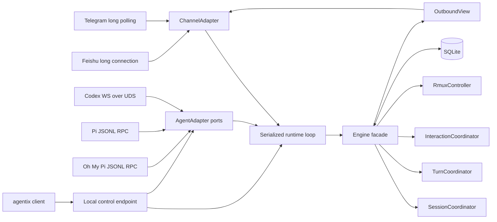
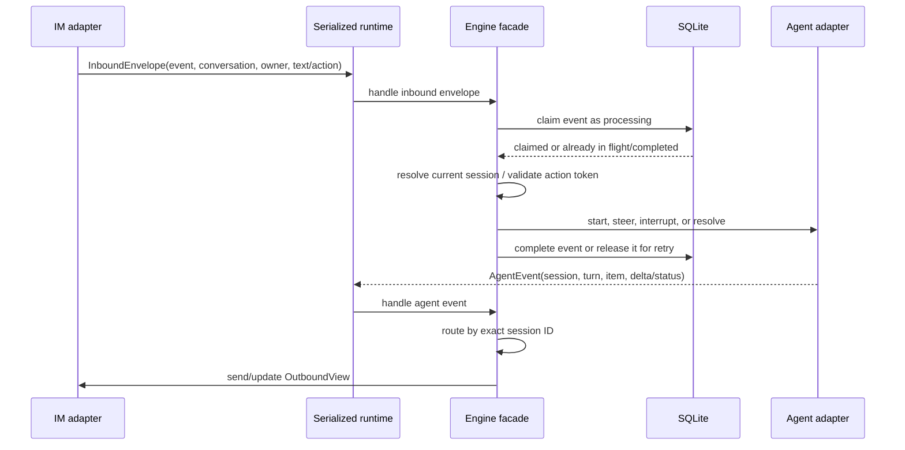

# Agentix Architecture

## 1. Overview

Agentix uses a ports-and-adapters layout. The core owns identity, binding, routing, persistence, and presentation semantics. Agent and IM crates translate external protocols into the core model.

The executable selects one `AgentAdapter` and one or more `ChannelAdapter` implementations from validated TOML configuration.

`Engine` is the orchestration facade rather than the owner of one large shared state bag. `SessionCoordinator` owns bindings, session metadata, and history cursors; `TurnCoordinator` owns active turns, render buffers, and message references; `InteractionCoordinator` owns pending interactions and scoped actions; and `RmuxController` isolates workspace-runtime access. External I/O remains in the facade so durable transitions and follow-up effects have an explicit order.

## 2. Crates

| Crate | Responsibility |
| --- | --- |
| `agentix-core` | domain types, capability ports, coordinators, command parsing, SQLite state, routing, and rendering orchestration |
| `agentix-codex` | app-server protocol, native WebSocket-over-UDS client, history fallback, reconnect/resubscribe |
| `agentix-pi` | shared Pi/Oh My Pi JSONL RPC subprocess client and JSONL session discovery |
| `agentix-telegram` | owner policy, mention handling, native command menu, long polling, message edit, callback acknowledgment |
| `agentix-feishu` | owner policy, long connection, Card JSON 2.0 send/edit, dynamic command cards, reply-context lookup, card callbacks |
| `agentix` | config, dependency assembly, lifecycle, local control transport, `serve`, `doctor`, and the diagnostic CLI client |

## 3. Canonical data flow

The runtime owns one `tokio::select!` loop for inbound IM envelopes and agent events. Both streams therefore enter the engine serially, while each transport may continue doing its own network I/O concurrently. This removes races between an inbound action and the event that completes or invalidates the same turn.

`ConversationRef` consists of channel kind and channel-native conversation ID. `SessionId` is opaque. Because a running instance selects one backend, raw backend session IDs are sufficient internally; a future multi-backend instance should introduce an `AgentSessionKey { backend, id }` before allowing mixed adapters in one process.

## 4. Binding state machine

The in-memory `BindingTable` has three indexes:

- `by_conversation`: current session for a chat
- `by_session`: current chat for a session
- `draining`: previous active sessions still allowed to deliver critical events

SQLite enforces the same one-to-one current mapping with a primary key on conversation and a unique constraint on session ID. Binding epochs increment on attach/detach and provide a durable invalidation boundary. The persisted epoch is authoritative: startup restoration and every subsequent attach copy it into the in-memory binding table, so repeated restarts cannot reset or desynchronize the epoch.

Attach and detach use a state/effect boundary. The SQLite transition is committed first, then the in-memory coordinator is updated. Subscription cleanup, command-menu updates, and IM notifications run afterward as best-effort effects. A temporary channel failure therefore cannot roll back or misreport an attachment that is already durable.

Delivery classification:

| Route | Stream event | Interaction | Completion |
| --- | --- | --- | --- |
| Current/live | deliver | deliver | update the live turn card |
| Draining | suppress | deliver with background label | update the existing card and add Attach |
| Unbound | suppress | suppress | notify known authenticated conversations with Attach |

## 5. Turn rendering

The `/sessions` picker renders each session as a numbered quote block with a title, status indicator, and monospace workspace path. Workspace paths under the current user's Home directory are abbreviated with `~` before entering the channel adapter. Telegram disables automatic link previews on sends and edits so filesystem paths cannot create unrelated webpage cards.

Turn buffers are keyed by `(session_id, turn_id)` and accumulate user text and assistant deltas. Message references use the same key. The first visible conversation event sends a message; later visible events edit that exact message. Live turns, attach hydration, and history pages all use the same conversation layout: the user input and Markdown agent output appear in separate quoted sections under their respective headings. When attach hydration finds that the latest turn is still in progress, it restores the active-turn route, buffer, and message checkpoint, then issues a fresh owner-bound Stop action. Live headers use short turn IDs and human-readable statuses. Tool start and completion events do not trigger IM sends or edits, and history rendering omits tool summaries. Approval requests remain separate actionable views.

A terminal event without a live or draining route is a background completion. The engine sends it only to authenticated IM conversations already known to the current process, labels it with the session title and short ID, and issues an owner- and conversation-bound Attach action. A draining completion edits the existing turn card and adds the same action. Successful deliveries are deduplicated by `(conversation, session_id, turn_id)`, including a draining event replayed after its route has been removed. Current-session completions stay on their live card and never produce the background notice.

For Codex, ordinary input received during an active turn uses the experimental `thread/queue/add` API instead of `turn/steer`. The server persists each input as a separate FIFO follow-up turn and emits `thread/queue/changed`; Agentix parses that notification and reads `thread/queue/list` to render `/queue` and determine the position shown in its immediate enqueue confirmation. Idle input still uses `turn/start`. Adapters that do not advertise persistent queue support retain same-turn steering.

This app-server queue is distinct from the Codex TUI's Tab queue in Codex CLI 0.153.0. The TUI stores Tab-submitted messages in process-local memory and currently ignores `thread/queue/changed`; app-server exposes no RPC for that local state. Agentix therefore cannot merge or deduplicate the two queues without a Codex protocol change. If both contain pending input when a turn completes, the TUI and app-server queue services may independently attempt to submit their respective heads, yielding back-to-back turns without a shared ordering guarantee. Terminal input injection and screen scraping are deliberately excluded because they can corrupt an existing draft, truncate long queues, and duplicate turns.

Queueing is an optional `QueuedPromptPort`; attached-session commands use `SessionControlPort`; and rmux operations use `WorkspaceRuntimePort`. `AgentAdapter` contains only operations common to every backend and exposes an `AgentCapabilities` value derived from the optional ports. The engine uses those capabilities to construct help and command menus instead of relying on backend-name checks or a growing set of support booleans.

Non-final event rendering is throttled to one update per second. Independently, the engine loop ticks once per second and refreshes every visible attached turn so its locally measured working duration advances even without agent output. Timer refreshes reuse the current Stop action token; they do not create an action-invalidating race. Completion is never throttled, always flushes the accumulated text, records the final duration, and removes the turn from future ticks. Restored running turns start a fresh local measurement because upstream history does not expose a compatible monotonic start instant. This balances responsive progress with Telegram edit pressure and Feishu card churn. Telegram converts quoted sections independently to escaped MarkdownV2 before restoring their quote markers, preserving paragraph and list boundaries inside each visual block. Conversion happens before length enforcement so truncation cannot leave broken formatting delimiters.

## 6. Agent transports

### Codex

Agentix connects to `unix://`, `unix:///absolute/path`, or a home-relative endpoint such as `unix://~/.codex/custom.sock` using WebSocket framing over a Unix stream. Configuration parsing expands the home-relative form before transport initialization. If the managed `unix://` socket is missing or refusing connections at startup, Agentix runs the configured Codex executable with `app-server daemon start`, waits up to five seconds for the socket, and retries the handshake. Custom socket paths remain externally managed and are never auto-started. After connecting, Agentix performs `initialize`, advertises `experimentalApi`, sends `initialized`, and then uses app-server JSON RPC methods.

On disconnect it:

1. fails pending request waiters;
2. emits a generation-scoped disconnect event, invalidating old UI actions;
3. reconnects with exponential backoff;
4. performs a fresh initialize handshake;
5. swaps the writer and replays `thread/resume` for attached sessions;
6. emits a new connection generation.

The current generation is shared atomically by every `CodexClient` clone so actions created after reconnection are scoped to the new connection. If the connection closes before an attach-related `thread/read`, `thread/resume`, or history response arrives, Agentix waits for the next generation and keeps retrying that idempotent request across transient reconnects within one 30-second deadline. Every `thread/resume`, including subscription replay after reconnect, sets `excludeTurns: true`; paginated history is fetched separately with `thread/turns/list`, avoiding the unsupported full-history resume path for an already-running thread. Mutating turn and approval requests are not retried automatically because their execution status may be ambiguous after transport loss.

For the managed control socket, session discovery starts from interactive Codex TUI processes. Standalone sessions are mapped through their open `thread-writer-locks/<session-id>.lock` files. Daemon-backed clients are matched one-to-one by working directory against `thread/loaded/list`, preferring active and recently updated threads. Agentix then uses `thread/read` to normalize metadata and discards ephemeral threads without a rollout before matching. This includes standalone sessions that the daemon reports as `notLoaded` while excluding stored sessions and orphaned daemon threads. Attach calls `thread/resume` in metadata-only mode and then pages history independently. If Codex reports that a listed running thread has no rollout because it has not received its first user message, Agentix records a provisional subscription and presents empty history; the first `turn/start` materializes the thread and completes `thread/resume`. A session that cannot be confirmed in the running list is still rejected, so a stale or forged action cannot bind an internal thread.

The Codex adapter checks subscribed sessions against the same process-backed discovery snapshot every two seconds. Two consecutive missing snapshots confirm an exit and avoid detaching on a single transient process-inspection race. Only that process-backed signal suspends the live attachment: app-server `thread/closed`, `notLoaded`, transport disconnects, and Agentix shutdown are not proof that the interactive Codex process exited. The core marks any visible running turn as interrupted, invalidates its Stop action, retains the durable desired binding, and sends an automatic-detach warning to the bound IM conversation. The adapter keeps the exited session in its process watch set. When the same session ID reappears after `codex resume`, it restores the metadata-only app-server subscription, emits a resume event, and the core atomically restores the live IM binding and attached command menu. Manual detach or replacement removes the process watch. Graceful Agentix shutdown likewise retains the durable binding while temporarily presenting the IM as detached; restart and transport reconnect restore the subscription.

Custom Codex sockets cannot be correlated with the managed local process tree, so they use `thread/loaded/list` directly.

History prefers `thread/turns/list` and falls back to stable `thread/read(includeTurns=true)` when the experimental method is unavailable. Persistent follow-up queue writes require Codex's experimental queue methods; the initialize handshake already advertises `experimentalApi`.

Stable control-path responses are deserialized into protocol DTOs rather than inspected as ad hoc JSON. These types cover turn start/steer, queue add/list, and model/reasoning discovery. Raw JSON remains available for experimental commands and the diagnostic CLI.

### Agentix local control

`serve` owns the only backend adapter used by its IM channel and its local CLI clients. It exposes a small newline-delimited JSON protocol over `unix://~/.local/share/agentix/control.sock` by default on macOS/Linux or `tcp://127.0.0.1:32198` on Windows. Each connection carries one request and one response. Requests either list sessions through the shared adapter, pass a raw RPC through the existing Codex connection, or create a temporary owner claim for the selected IM channel. This keeps client diagnostics consistent with the live service and avoids a second direct Codex app-server connection.

The Unix listener is owner-only (`0600`), removes stale sockets before binding, and removes its own socket during graceful shutdown. TCP listeners are restricted to numeric loopback addresses. The endpoint can be overridden by `[server].endpoint`.

The workspace runtime is rmux-specific. `agentix-codex` talks to the official Rust SDK with typed requests for snapshots, session/window/pane creation, process launch, foreground state, and pane input. Reusing an existing shell pane sends `Ctrl-C` through the typed input request before the structured process respawn so an unsubmitted shell command cannot be combined with the launch; newly created panes do not need this reset. Core mutation types intentionally contain no backend-kind discriminator: selecting a second multiplexer would require a separate runtime port rather than conditionals spread through the engine.

### Pi and Oh My Pi

Both use their official `--mode rpc` newline-delimited JSON protocol. Agentix discovers JSONL session headers and starts one subprocess per attached session (`pi --session <path>` or `omp --resume <path>`). This is important: independent stdout streams retain an unambiguous session context even when multiple agents run concurrently.

Each prompt is assigned a local turn ID before it is written. Stream, tool, completion, and extension UI frames are normalized with that session/turn context. `omp` protocol-v1 frames are supported; frames remain subject to its v1 physical size bound.

## 7. Channel transports

Each service process starts exactly one channel adapter selected by `[channel].kind`. Telegram settings live under `[channel.telegram]` and Feishu settings under `[channel.feishu]`. Telegram uses long polling; callback queries are answered immediately and then normalized. Feishu uses the SDK's long WebSocket connection with automatic reconnect and callback acknowledgment. It resolves reply `parent_id` values through the get-message OpenAPI and falls back to the unquoted prompt when the parent is unavailable. Feishu OpenAPI operations treat business code `99991663` as a stale tenant access token: the adapter expires the exact cached token entry and replays the operation once, while a repeated failure is returned without further replay. The SDK client uses one transport attempt per operation so this adapter-level bound is preserved. The SDK policy and Agentix policy both enforce owner and mention rules. When either channel starts without configured owners, its adapter accepts only `/claim <code>` as an enrollment operation from unknown private-chat senders.

The local `agentix client claim` request asks `serve` to replace its single pending claim with a random code and Unix expiry held only in memory. The same registry is injected into the selected Telegram or Feishu adapter. A successful private-chat match atomically persists the sender's numeric Telegram user ID or Feishu `open_id` before enabling it in memory and consumes the claim. Expired or mismatched codes do not change authorization. The code, hash, and expiry are never persisted, so service restart invalidates every pending claim. Running both transports requires separate Agentix config/state instances.

Channels receive a generic `CommandMenu` made of command name, description, and contextual metadata. Telegram maps it to a chat-scoped native menu, while Feishu maps it to an editable command card. Both adapters add the attached-session marker to contextual entries; the core does not know about platform-specific scopes, colors, cards, or emoji.

Action callbacks retain the source `MessageRef`. Once the core validates and consumes the opaque token, it asks the originating channel to disable that message's action group before executing the operation. Telegram removes the inline keyboard. Feishu retains only live actionable views in an in-memory cache and edits the consumed card with disabled buttons. Feishu command-card callbacks carry slash commands rather than one-time action tokens, so the menu remains reusable and is edited in place across attach/detach transitions. Failure to update controls is logged but does not roll back or duplicate the validated upstream action.

## 8. Persistence

SQLite stores bindings, binding epochs, processed IM event state, active turn-message checkpoints, and the pending-interaction schema. Processed events move through `processing`, `completed`, and `failed`; delivery failures release a claim so the same channel event ID can be retried, and startup reclaims work left in `processing` by a crash. Completed events remain idempotent.

Generic action payloads remain in memory by design. `ActionRegistry<T>` binds every opaque token to its conversation, owner, connection generation, binding epoch, and action group. A successful choice consumes the token and revokes its sibling choices; disconnect invalidates only actions belonging to that connection generation. A restart deliberately expires all such actions instead of replaying security-sensitive RPC responses against another process. Active-turn Stop actions are reconstructed separately from the persisted turn, message, and owner context, so they receive fresh tokens after restart.

On graceful shutdown, the engine checkpoints SQLite, invalidates transient actions, removes live controls from persisted turn messages, switches bound conversations to detached menus, and sends an offline notification. At startup, the engine reads durable bindings, attempts each upstream attachment, and sends an online status notification. Successful attachments reconstruct the in-memory routing indexes and extended menus. Rejected stale attachments are deleted and remain detached. The engine then restores in-progress turn buffers and message references for successful attachments and updates each original IM message with a newly issued Stop action. Completion continues editing that same message, removes its controls, and deletes the checkpoint.

## 9. Failure behavior

- Completed or concurrently processing IM event: return success without executing again.
- Failed IM delivery: retain the event ID in a retryable state and execute it again on redelivery.
- Missing/stale action: reject without upstream side effects.
- Agent RPC rejection: log and return a channel-level request failure.
- Binding menu/notification failure: preserve the already committed binding and log the failed effect.
- Turn IM send/edit failure: preserve the turn buffer so a later final update still has full content.
- Lagged broadcast receiver: log the dropped count; completed history remains recoverable from the backend.
- Missing bound session during restore: fail startup rather than silently misroute.

## 10. Test architecture

The workspace uses four complementary test layers:

| Layer | Coverage |
| --- | --- |
| Pure protocol and model tests | JSON decoding, command parsing, rendering, binding rules, and process/rmux mapping |
| Adapter integration tests | Mock Telegram Bot API, mock Feishu OpenAPI/WebSocket, mock rmux protocol daemon, fake Pi RPC subprocess, process-level CLI, configuration, and focused Codex UDS behavior |
| Core orchestration tests | durable attachment, routing, queues, menus, turn rendering, approvals, plan input, shutdown, restart, deadline, and retry semantics |
| Stateful Codex integration tests | real WebSocket-over-UDS handshake, the complete Agentix-used RPC/event subset, and full Telegram/Feishu-to-`Engine`-to-Codex scenarios |

The Codex integration fixture is an in-process mock app-server under `crates/agentix-codex/tests/support/`. Its wire shapes follow the Codex CLI 0.153.0 generated schema for the subset consumed by Agentix. It owns mutable thread, turn, queue, model, reasoning, and goal state; records RPC results, notifications, server requests, and client responses; supports cursor pagination and deterministic RPC failure injection; emits lifecycle, queue, tool, approval, user-input, and externally resolved interaction events; and accepts replacement connections.

The integration suite exercises all 21 client RPC methods used by Agentix. It verifies required protocol fields, session and turn lifecycle, history pagination and fallback, queued prompts, every attached-session command, command and file approvals, plan-style user input, status and tool events, reconnect/resubscribe, and complete Telegram/Feishu-to-engine-to-Codex round trips. Agentix control tests exercise Unix and TCP socket lifecycle, malformed and oversized requests, and process-level client requests without allowing the client to contact the mock Codex socket directly. Service tests cover durable reattachment across restarts, offline notification, retained bindings, control-listener orchestration, and the shared five-second shutdown deadline. CLI diagnostics verify runtime file logging, local timestamps, ANSI-free files, rotation, and bounded retention. The fixtures are hermetic: they do not depend on a developer's Codex installation, daemon state, session files, or network.

The Telegram fixture implements the Bot API methods used by the adapter and records requests while serving queued polling updates and injected failures. It verifies bot discovery, menus, owner filtering and claiming, callback acknowledgement, send/edit payloads, MarkdownV2, and inline-keyboard cleanup. The Feishu fixture implements the consumed token, bot, message, and WebSocket endpoints. It issues rotating tenant credentials, sends official SDK protobuf frames, and verifies inbound message/card-action delivery, frame acknowledgements, interactive cards, updates, authorization, owner claiming, and API error mapping. Invalid-token coverage exercises every Agentix-owned Feishu OpenAPI call site: sends, card edits, action cleanup, both command-menu mutations, reply lookup, and claim responses. Separate cases prove retry exhaustion, no retry for unrelated API errors, and no business-request replay when refreshing the token itself fails. CLI integration tests launch the compiled binary against a mock Agentix control endpoint, including terminal-only claim generation, while the Pi fixture provides a deterministic JSON-RPC subprocess.

rmux integration is split at the workspace-runtime boundary: Codex adapter tests validate typed SDK inventory conversion and launch arguments, core tests validate navigation and mutations against a fake runtime port, and a mock Unix daemon decodes the real `rmux-proto` packets sent by the public `rmux-sdk` client for pane clearing, process respawn, session/window creation, and splitting. Connecting to a live rmux daemon is retained as an environment smoke test because the daemon is maintained outside this workspace.

CI runs all platform-applicable tests on Linux, macOS, and Windows, including the TCP control suite on each platform. `agentix-codex` exposes a clear unsupported-transport result on Windows because Codex app-server integration currently requires WebSocket over a Unix-domain socket.

Focused scripted UDS tests remain useful for malformed, missing, or version-specific response shapes. The stateful mock is used when correctness depends on a sequence of operations and the state created by earlier requests.

## 11. Task coordination

`agentix-task` owns an independent SQLite database, task leases, dependency validation, audit events, and read-only document projection. `taskcli` and the optional Engine task-board integration share this library. Task action buttons reuse the existing ActionRegistry scope and add task revisions and lease fencing; periodic runtime refresh consumes event cursors for bound-session notifications. Future Agent Team tooling owns shared Job context externally. See [Task board](task-board.md) for the full API and recovery boundaries.
