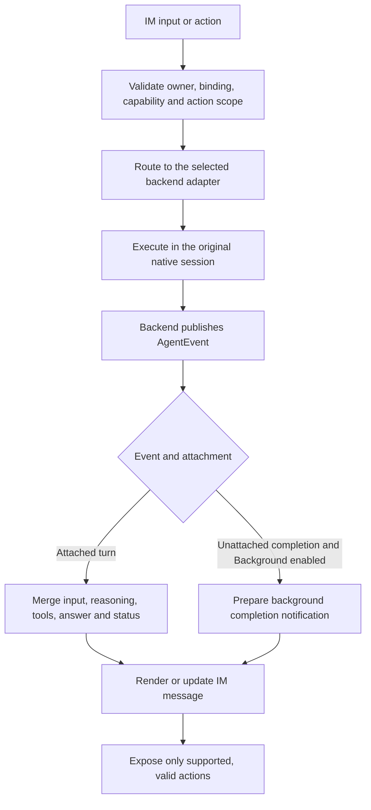
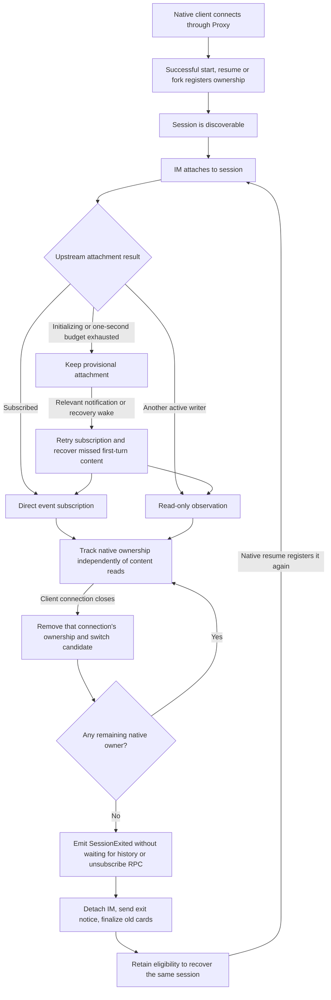
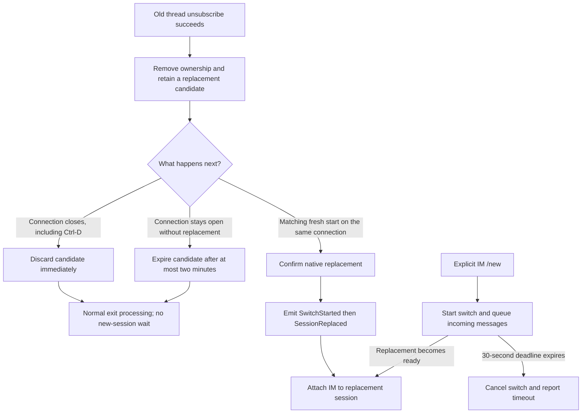
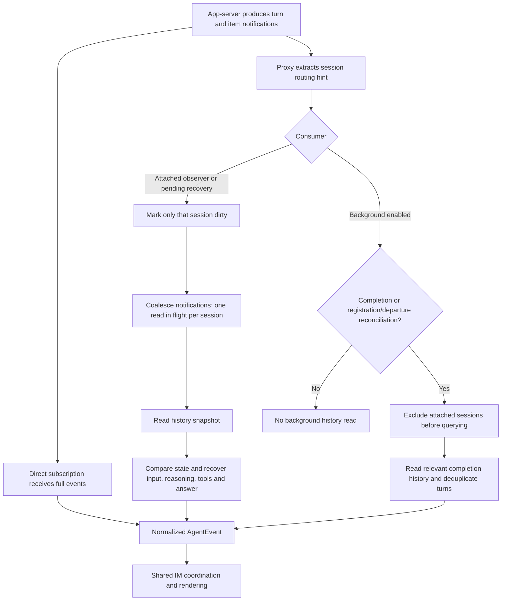
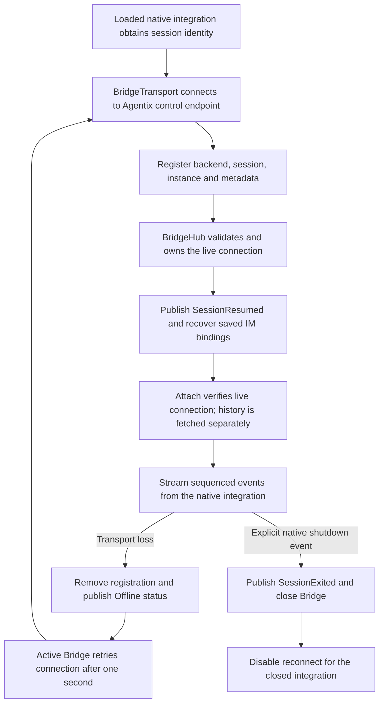
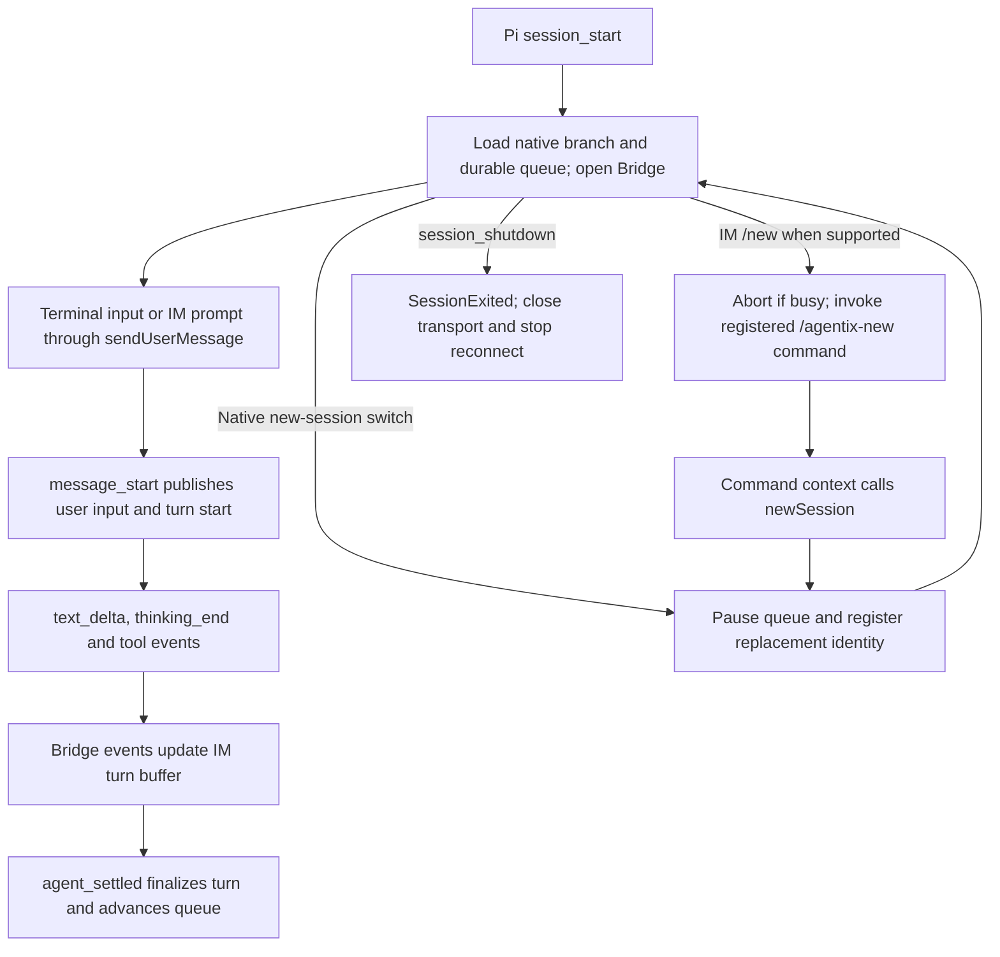
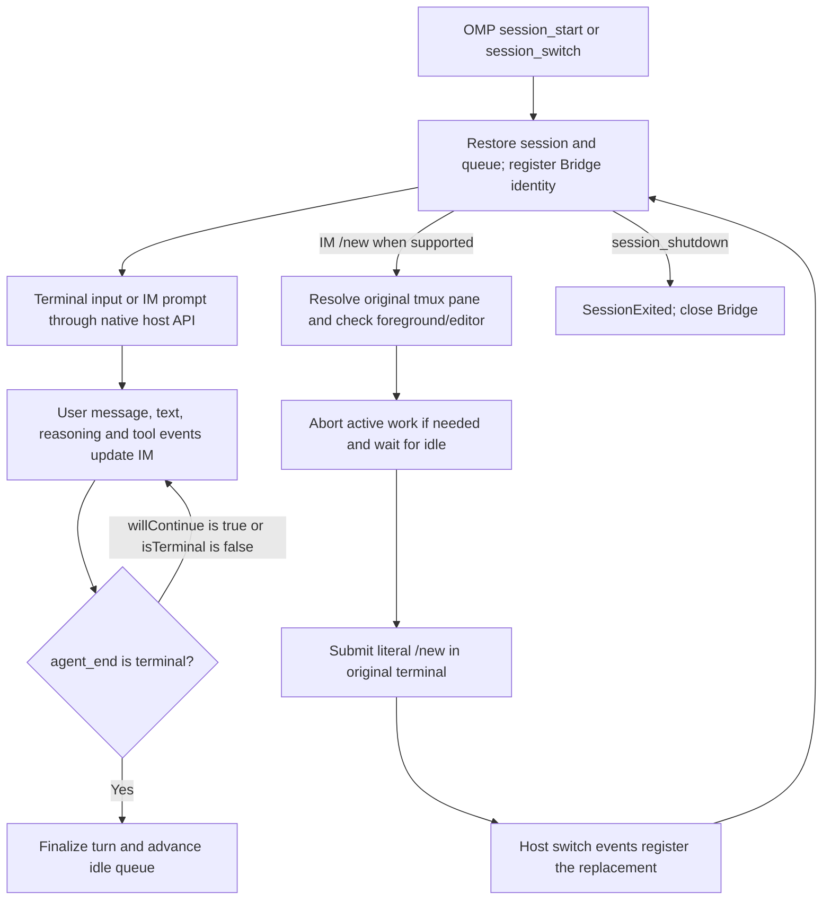
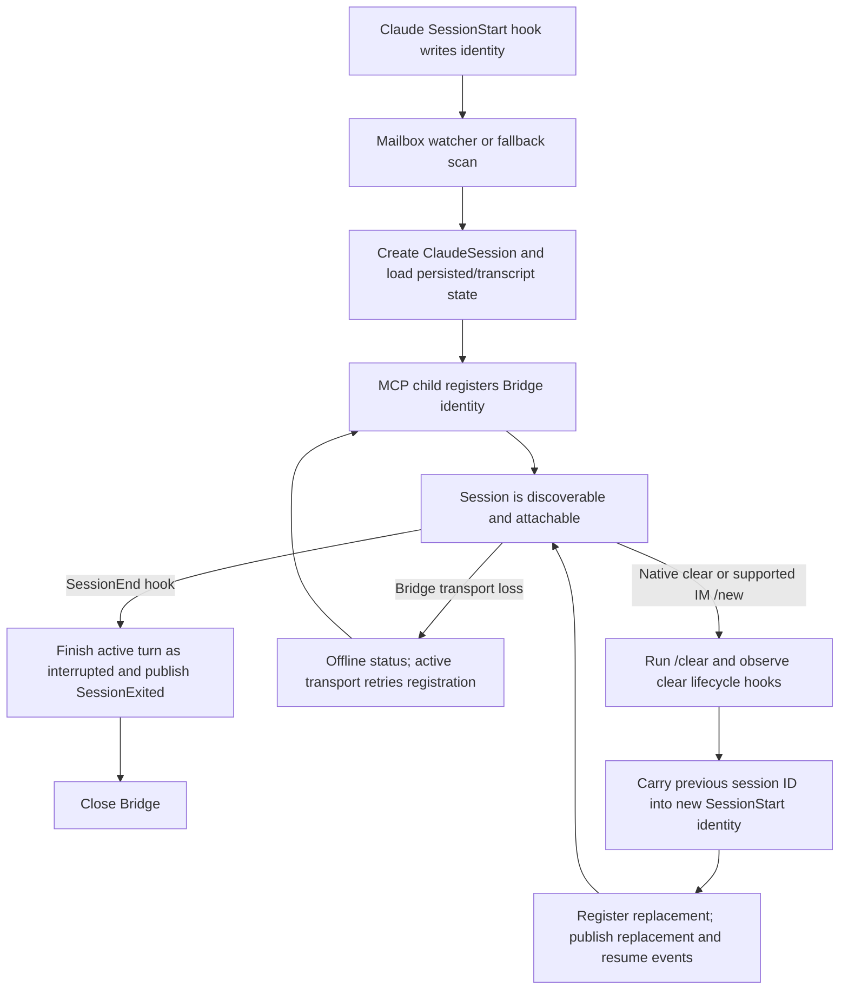
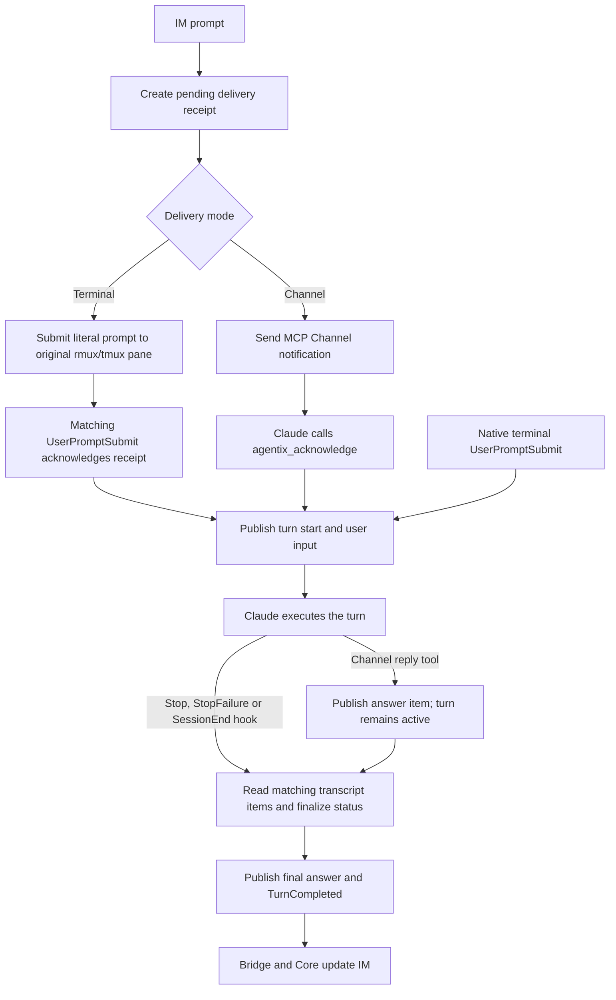

# Session Lifecycle and Message Flows

This document describes the implemented Codex, Pi, OMP, and Claude Code paths in
this source tree. The diagrams distinguish native session lifetime, IM attachment,
and turn lifetime: completing a turn does not exit its session, and detaching an
IM conversation does not terminate the native process.

See [Architecture](architecture.md) for component boundaries and
[Host protocol](host-protocol.md) for the native Bridge wire contract.

## Shared IM coordination

Engine routes backend-qualified session IDs to the appropriate adapter.
SessionService manages saved bindings and recovery; TurnCoordinator merges live
and historical content into turn buffers. Backend capabilities determine available
commands and actions. A running Codex, Pi, or OMP turn can expose Stop; Claude does
not advertise remote stop. Reasoning visibility follows the configured display
policy and the content actually supplied by the backend.

For IM input sent to an idle session, an acknowledgement taking more than 100 ms
triggers a `Sending…` card containing the input. Once the backend supplies a turn
ID, the same card becomes the live turn card with the supported actions. A failed
or uncertain acknowledgement finalizes the pending card accordingly; the display
deadline never cancels or resends the input. Channel delivery still contributes
its own latency.

The production dispatcher gives the pending input card a 50 ms posting budget.
If posting takes longer, an owned task continues the same channel request while
the session lane is released. Card completion returns through the conversation
and session reservations. Received output is accumulated until the card ID is
available, then the same card is updated to the latest turn state. A late card
cannot restore actions in a detached or exited session. Exit preserves the last
available output for the pending card, and shutdown fences already admitted card
completions. Waiting for a card ID does not consume the channel update interval,
so the first visible output after reattachment is not delayed by an invisible
render. If the progress card fails, accumulated output is still eligible for
normal turn delivery.

A separate owned task continues the original backend request; its acknowledgement
returns as dispatch work that reacquires the conversation and session reservations.
Early turn events reuse the input card, and a late acknowledgement preserves
already completed output. Up to 32 unacknowledged starts and 32 pending card
postings are owned concurrently; additional starts retain the synchronous path instead of dropping or resending a
request already in flight. Each session accepts up to 16 local follow-up inputs
while awaiting delivery. Follow-ups retain the original binding epoch and backend
generation, remain ordered across runtime admission, and are cancelled if the
conversation switches or the user stops the turn. A Stop received before the turn
ID is available is applied when a start event or acknowledgement supplies it.
Shutdown fences unresolved deliveries, including follow-ups already admitted to
the dispatcher. The synchronous `handle_inbound` API retains its await-until-result
contract; runtime callers use `execute_work` and drain pending prompt work.

Switching or detaching revokes the old Stop action before editing its card. That
visual cleanup has a 250 ms budget per card so a stalled edit cannot indefinitely
hold session navigation. If the edit fails or times out, the old button may remain
visible, but its token is invalid and cannot stop either session.

Saved bindings are restored at service startup. Temporarily unavailable sessions
remain eligible for recovery. Reconnection invalidates obsolete action scopes;
history reconciliation restores content rather than replaying uncertain mutations.
A lost response after a mutating request was dispatched does not authorize an
automatic retry.

Missing input history is recovered outside the session event dispatch lane. An
immediately available result is merged before rendering; a pending read does not
hold back received output or Stop actions. Reads are deduplicated by session and
turn, with at most eight active reads. Completion wakes the runtime and is applied
under the normal session/conversation reservation. Recovery updates the original
card, including an already archived completed turn, without overwriting newer
native input. Binding epochs and adapter generations fence stale results; session
exit cancels its reads, and runtime shutdown stops new recovery requests. This
path adds no periodic polling.

For a confirmed session exit, local bindings/actions are invalidated and the exit
notice is sent before old cards are finalized. Card finalization shares a one-second
budget. Completed, failed, and interrupted turns retain their status; only running
or unknown turns are changed to interrupted. Native replacement events take the
session-switch path so an old-session exit does not discard the replacement.

## Codex

### Discovery, attachment, exit, and resume

The `serve` path uses the Proxy registry. Successful non-ephemeral
`thread/start`, `thread/resume`, and `thread/fork` responses establish ownership
between a client connection and a session. Broadcast notifications and failed
responses do not establish ownership. Multiple connections can own the same
session. Agentix's own upstream subscription does not establish terminal ownership.

An empty session can be registered before its rollout/history is materialized.
Provisional attachment preserves interest in it; recovery captures input and output
that arrived before a usable subscription. Optional title lookup runs in an owned
background task with a one-second budget. Attach, resume, startup restoration and
background completion feedback use available metadata without waiting for this
read. Concurrent callers share one list request; completed metadata populates the
cache for subsequent views. Until then, labels fall back to the session ID. Dropping
the session service cancels a pending read.

EOF, transport errors, completed connection closure, and Proxy shutdown release
ownership. Exit does not wait for the peer PID to disappear. A silent network
partition is not an observed connection closure: there is no proactive heartbeat
that guarantees a detection deadline.

### Native `/new` versus Ctrl-D

The native correlation also handles a fresh start arriving before unsubscribe.
Unsubscribe alone does not emit a switch notice because Ctrl-D can use the same
RPC. Candidates are local to an open connection and never cross disconnection.
The two-minute candidate deadline and the 30-second IM switch deadline serve
different purposes.

### Attached and background messages

Lifecycle, attached-content recovery, and background completion reads run in
separate tasks. Content notifications do not wake lifecycle processing.

The observer path uses notifications as a reason to read, not as a direct copy of
each text delta into IM. Ordinary content reads have a 100ms minimum spacing.
Notifications received while waiting are merged into the read's version; changes
received during a read cause a follow-up. Initial recovery and resumed-session
recovery bypass that spacing. Unrelated content notifications do not trigger
unrelated session RPCs; registration, local configuration, and reconnect wakes
can still require broader reconciliation.

Background processing reads newly registered/departed sessions and sessions with
completion notifications, plus an initial reconciliation when enabled. It skips
attached sessions before issuing requests. History prefers `thread/turns/list`,
with `thread/read(includeTurns=true)` as a compatibility fallback.

The legacy direct client API has no Proxy notification source and retains its
10-second polling interval. The Proxy path has no periodic content/history poll
while idle. The 100ms spacing is not an end-to-end IM latency guarantee: RPC,
render scheduling, and channel delivery add their own latency.

## Shared native Bridge lifecycle

Pi and OMP load an extension in the original process. Claude loads an MCP child
that uses the same Bridge transport. All connect outward to Agentix's local
control endpoint. BridgeHub is the authoritative live connection registry;
listing sessions does not scan all native history files. A second live instance
claiming the same backend/session is rejected.

Offline status on socket loss is distinct from an explicit native exit. An
integration that remains loaded retries even if Agentix starts later. No loaded
Bridge means no such automatic discovery. Detaching IM does not close the Bridge.

Frames carry an instance and sequence number. Stale/duplicate frames are ignored;
a sequence gap or invalid session identity closes the connection for recovery.
Live events are not buffered by the transport while disconnected; native history
and persisted receipts provide recovery data after registration.

## Pi

Pi's lifecycle comes from `session_start`, `session_before_switch`,
`session_switch`, and `session_shutdown`. A new-session switch pauses the remote
queue, records the previous session ID, and emits `SessionSwitchStarted`. The new
registration carries the previous ID and stable client ID, allowing BridgeHub to
emit `SessionReplaced` followed by `SessionResumed`. Other session switches do not
claim a native `/new` replacement.

Pi completes a turn on `agent_settled`, not merely `agent_end`. This avoids ending
the IM turn before host continuation has settled. Assistant text is streamed;
reasoning is published on `thinking_end`, and tool start/end events update items.
History projects the current native branch and saved associations. Queue mutations
and delivery receipts are persisted in native custom entries; the queue pumps when
the host is idle and after settled completion.

## OMP

OMP uses the same Bridge lifecycle, event conversion, native-history projection,
and durable queue as Pi. Its host adapter selects different completion and
new-session operations.

OMP finalizes on `agent_end` only when `willContinue` is not true and `isTerminal`
is not false. Remote `/new` is advertised only with the required terminal/editor
support. NativeSessionControl verifies the original foreground pane, requires an
empty editor, and uses the fixed `/new` command. Its busy-stop wait checks every
50ms for up to 30 seconds; this is a command-local wait, not session discovery
polling. Remote Stop and metadata/history/queue reads can bypass a pending
extension command.

## Claude Code

Claude's MCP child obtains identity from exec-form hooks through a private mailbox.
Filesystem notifications trigger consumption, with a one-second fallback scan.
The child registers a Bridge only after a SessionStart identity is available.
State uses a checkpoint and incremental journal; transcript history supplies
content recovery. Each session caches its latest transcript turn and UUID deduplication
state. On completion it compares the bounded raw tail with the previous bytes and
parses only newly appended complete records. Rewrites, truncation, session changes,
and a moving 16MiB window rebuild the projection; callers receive independent
snapshots. The full-history startup reader remains stateless.

### Lifecycle and replacement

A `SessionEnd` with reason `clear` also emits a switch-start event. A subsequent
`SessionStart` with source `clear` records the previous identity for replacement
correlation. MCP stdin EOF or process shutdown closes the transport; an abrupt
loss may be observed only as Offline if no SessionEnd hook was delivered.

Remote `/new` is available only when the terminal delivery integration supplies
native new-session control (including the tmux requirement). It submits `/clear`
to the original pane after foreground/readiness checks and stopping active work.
Channel mode does not advertise this terminal control.

### Input, completion, and IM output

The standard hook path does not stream every token. It publishes input at prompt
submission, then imports matching transcript reasoning/tools and final content
when a completion hook is processed. `Stop` completes the turn, `StopFailure`
fails it, and `SessionEnd` interrupts an active turn. A Channel reply can publish
answer text earlier but does not itself complete the turn.

Claude advertises prompt, history, status, and uncertain-delivery recovery controls;
it does not advertise remote Stop, steer, or a FIFO submission queue. A pending
receipt guards concurrent prompt delivery. Acknowledgment loss can produce an
uncertain result, which must not be automatically resent.

## Timing and behavior comparison

| Mechanism | Codex Proxy | Pi | OMP | Claude |
| --- | --- | --- | --- | --- |
| Live discovery source | Successful native RPC ownership | Bridge registration | Bridge registration | Hook identity plus Bridge registration |
| Ordinary message updates | Direct events or targeted history reads | Native text/tool events | Native text/tool events | Prompt/completion hooks; optional Channel reply |
| Completion boundary | App-server turn completion | `agent_settled` | Terminal `agent_end` | `Stop`, `StopFailure`, or `SessionEnd` |
| Idle history polling | None | None | None | No periodic transcript read; mailbox fallback scan remains |
| Content read spacing | 100ms for ordinary observer reads | Not applicable | Not applicable | Not applicable |
| Bridge reconnect retry | Not applicable to Codex transport | 1 second | 1 second | 1 second while active |
| Native exit signal | Last ownership removed after closure | `session_shutdown` | `session_shutdown` | `SessionEnd`; abrupt transport loss reports Offline |
| Remote Stop | Supported | Supported | Supported | Not advertised |
| Remote new-session operation | Native/session-switch orchestration | Registered command calling `newSession` | Restricted terminal `/new` | Restricted terminal `/clear` when supported |

Shared explicit IM session switches have a 30-second deadline. Codex native
replacement candidates have a separate two-minute deadline while their connection
remains open. Bridge registration has a three-second connection/handshake deadline;
graceful Bridge close allows up to 100ms to flush. These values bound individual
operations, not total user-visible latency.

## Implementation references

- Codex: [client and monitors](../crates/agentix-codex/src/client.rs),
  [ownership registry](../crates/agentix-codex/src/registry.rs),
  [background completion reads](../crates/agentix-codex/src/client/background.rs).
- Shared native integration: [BridgeHub](../crates/agentix-bridge/src/bridge_hub.rs),
  [adapter and connection](../crates/agentix-bridge/src/bridge.rs),
  [Node transport](../plugins/agentix-bridge/transport.mjs).
- Pi and OMP: [extension runtime](../plugins/agentix-bridge/runtime.mjs),
  [host differences](../plugins/agentix-bridge/host.mjs),
  [native session projection](../plugins/agentix-bridge/session.mjs),
  [terminal new-session control](../plugins/agentix-bridge/new-session.mjs).
- Claude: [MCP server lifecycle](../plugins/agentix-bridge/claude/server.mjs),
  [hook mailbox](../plugins/agentix-bridge/claude/mailbox.mjs),
  [session and receipts](../plugins/agentix-bridge/claude/session.mjs),
  [setup and supported operations](claude-code.md).
- Shared IM behavior: [session switching](../crates/agentix-core/src/engine/session_switch.rs),
  [turn and exit handling](../crates/agentix-core/src/engine/turn_flows.rs).
