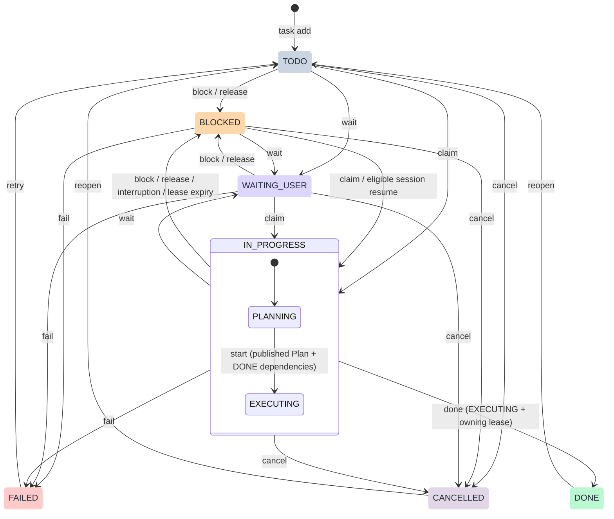
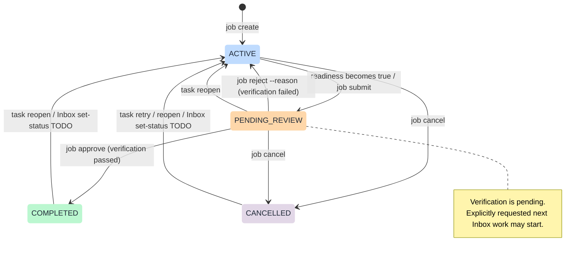
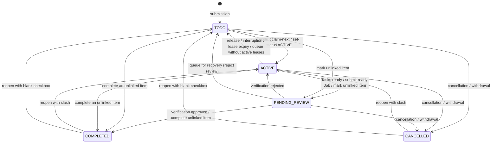

# Task, Job and Inbox state machines

SQLite enforces these transitions. The desktop Taskix Sync plugin submits saved Obsidian `status` edits through the same CLI; a rejected edit is restored and produces a notification. See [Obsidian setup and supported edits](../plugins/taskix-manager/obsidian/README.md#status-edits).

## Task

Claim creates a fresh lease and always enters PLANNING. Plan creation/revision and heartbeat preserve the phase; start retains the lease. Leaving IN_PROGRESS clears its phase and lease. Session resumption only reclaims eligible system-blocked work. Retry/reopen require an unarchived Job; reopening a prerequisite is rejected if a dependent has already started execution. Job cancellation also cancels unfinished Tasks after their leases have been released, while preserving DONE/FAILED/CANCELLED outcomes. These guards apply in addition to the arrows.

## Job

Readiness means at least one non-CANCELLED Task exists and every such Task is DONE. Only a false-to-true readiness transition submits automatically. Cancelling every Task never counts as delivery. A rejection records `review_reason` and preserves every Task's status; metadata edits, heartbeats, and sync do not resubmit it. Reopen a Task or add repair work to make changes, then finish that work, or explicitly use `job submit` after rechecking unchanged deliverables.

`pending_review_at` records the most recent transition into PENDING_REVIEW, including automatic readiness and explicit resubmission. Metadata edits, rejection, and approval preserve it; the Dashboard Pending review view sorts pending Jobs oldest first by this field; Recent Jobs sorts all statuses by latest update. Job document timestamps use the computer’s local time zone.

Approval alone sets `completed_at` and emits `job.completed`. Submission emits `job.pending_review`; rejection emits `job.rejected`. Resubmission and approval clear the current review reason; events retain the history. The CLI checks state and readiness, while the reviewer is responsible for performing acceptance checks. Agents must not approve their own delivery unless the user explicitly authorizes them to perform that verification.

PENDING_REVIEW is unfinished: it cannot be archived, blocks Project archival but does not block explicitly requested new Inbox intake, and sets its Inbox entry PENDING_REVIEW without a lease. Rejection returns that entry to ACTIVE for explicit recovery of its existing Job. Approval checks it off. COMPLETED and CANCELLED Jobs may be archived/unarchived; archival is an independent property, not another status. Database schema 9 preserves historical COMPLETED Jobs.

## Inbox item

| Checkbox | State |
| --- | --- |
| `- [ ]` | TODO |
| `- [/]` | ACTIVE |
| `- [r]` | PENDING_REVIEW |
| `- [x]` | COMPLETED |
| `- [-]` | CANCELLED |

The connected plugin submits checkbox edits through `inbox set-status` with revision checks and idempotency keys. Failed edits restore the matching checkbox and notify the user. Job readiness automatically sets the Inbox item PENDING_REVIEW; review rejection and approval map to ACTIVE and COMPLETED. An explicit TODO represents queued/released work, even when its existing Job remains ACTIVE.

Manual status changes never create Jobs or claim agent leases. Unlinked items can be marked ACTIVE or PENDING_REVIEW and completed directly. Activation resumes an existing linked Job; submitting or completing linked work retains the Job readiness and review checks. Explicit intake creates the Job for an eligible unlinked entry. Agents still need an explicit intake request to claim unleased TODO/ACTIVE entries, then follow the Task claim/Plan/start workflow. Reopening preserves Task outcomes and does not rerun DONE Tasks. Archived work must be unarchived first; withdrawn entries cannot be revived. Cancelled entries must be reopened before completion, and completed entries before cancellation.

Schema 10 migrates legacy Inbox IN_PROGRESS/DONE values to ACTIVE/COMPLETED and restores pending review from the linked Job. The CLI accepts legacy names as aliases; synchronization updates receipts and checkbox symbols. Plain CLI sync retains cancellation/withdrawal import but does not replay other status changes from checkbox drift.
