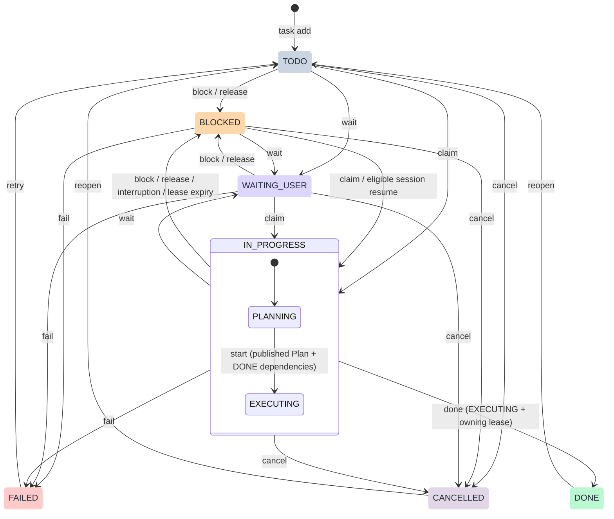
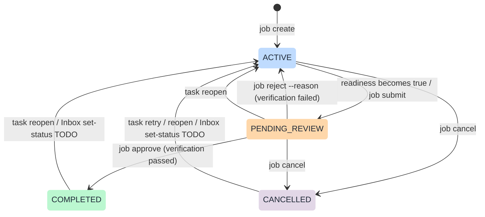
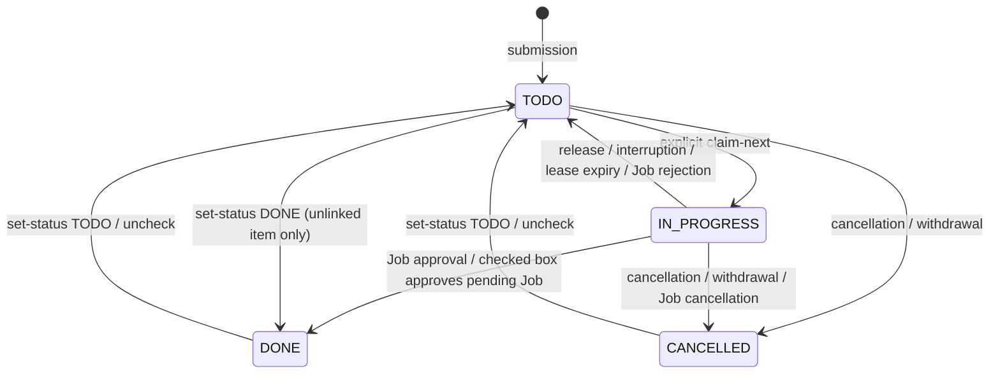

# Task, Job and Inbox state machines

SQLite enforces these transitions. The desktop Taskcli Sync plugin submits saved Obsidian `status` edits through the same CLI; a rejected edit is restored and produces a notification. See [Obsidian setup and supported edits](../plugins/agent-task-manager/obsidian/README.md#status-edits).

## Task

Claim creates a fresh lease and always enters PLANNING. Plan creation/revision and heartbeat preserve the phase; start retains the lease. Leaving IN_PROGRESS clears its phase and lease. Session resumption only reclaims eligible system-blocked work. Retry/reopen require an unarchived Job; reopening a prerequisite is rejected if a dependent has already started execution. Job cancellation also cancels unfinished Tasks after their leases have been released, while preserving DONE/FAILED/CANCELLED outcomes. These guards apply in addition to the arrows.

## Job

Readiness means at least one non-CANCELLED Task exists and every such Task is DONE. Only a false-to-true readiness transition submits automatically. Cancelling every Task never counts as delivery. A rejection records `review_reason` and preserves every Task's status; metadata edits, heartbeats, and sync do not resubmit it. Reopen a Task or add repair work to make changes, then finish that work, or explicitly use `job submit` after rechecking unchanged deliverables.

Approval alone sets `completed_at` and emits `job.completed`. Submission emits `job.pending_review`; rejection emits `job.rejected`. Resubmission and approval clear the current review reason; events retain the history. The CLI checks state and readiness, while the reviewer is responsible for performing acceptance checks. Agents must not approve their own delivery unless the user explicitly authorizes them to perform that verification.

PENDING_REVIEW is unfinished: it cannot be archived, blocks Project archival and new Inbox intake, and keeps its Inbox entry IN_PROGRESS without a lease. Rejection makes that entry available to resume its existing Job. Approval checks it off. COMPLETED and CANCELLED Jobs may be archived/unarchived; archival is an independent property, not another status. Database schema 9 preserves historical COMPLETED Jobs.

## Inbox item

The connected Obsidian plugin maps saved checkbox edits to `inbox set-status`, with a revision check, idempotency key and rollback notification on failure. Reopening a terminal entry reuses its Job, sets that Job ACTIVE, and preserves all Task states. It does not automatically claim work or rerun DONE Tasks. Archived work must be unarchived first; withdrawn entries cannot be revived. Cancelled entries must be reopened before completion, and completed entries before cancellation.

TODO and IN_PROGRESS share the blank checkbox. PENDING_REVIEW keeps the entry IN_PROGRESS without a lease; approval requires the Job's readiness checks. A blank box alone cannot release active ownership or reject verification: use the corresponding lease-authorized release or Job rejection. Plain CLI sync retains cancellation/withdrawal import but does not replay completion/reopening from checkbox drift.
