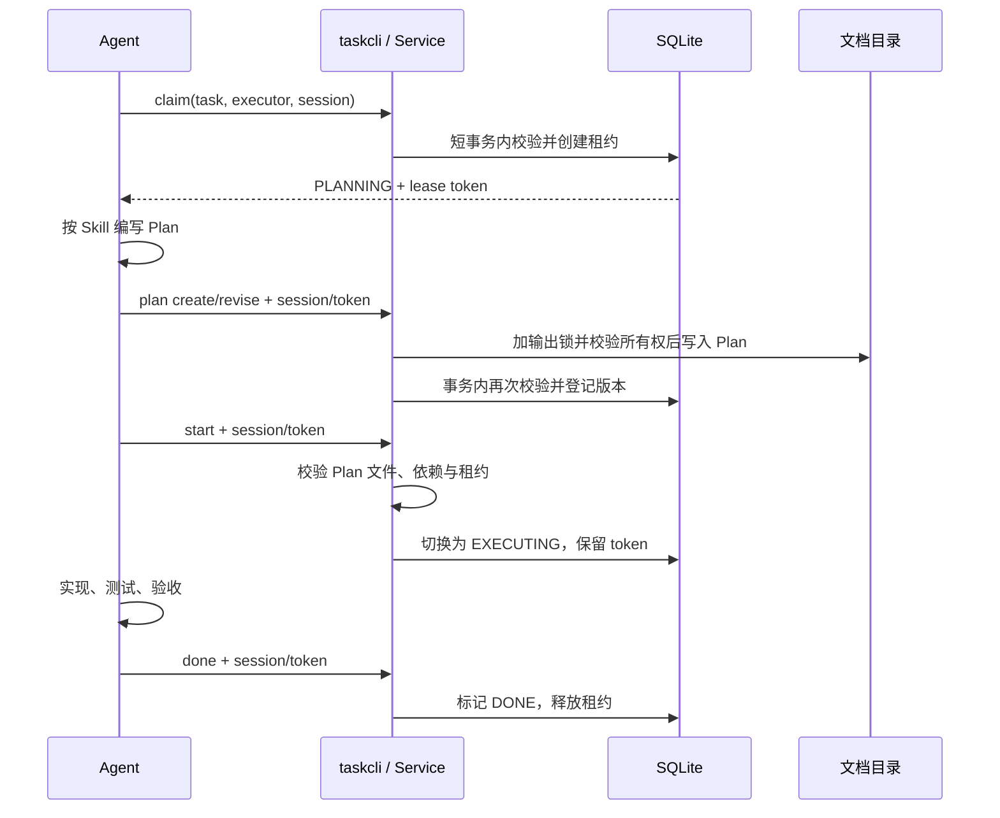

# 任务拆解、Skill 与 Hook 的工作机制

本文解释当前任务管理实现如何协作：谁负责拆解需求，谁决定开始或完成任务，谁维护会话状态，以及多 Agent 并发时哪些操作受到保护。命令参数和安装方法见 [任务看板使用指南](task-board.md) 与 [插件说明](../plugins/agent-task-manager/README.md)。

当前主流程是：`claim → 写 Plan → start → 执行与验收 → done`。这不是一个自动调度系统：Agent 按 Skill 做决策，Hook 响应宿主事件，taskcli 校验并保存任务事实。

## 1. 各层分别负责什么

| 组件 | 职责 | 不负责的事情 |
| --- | --- | --- |
| Agent | 理解需求、拆解任务、领取任务、编写 Plan、执行和验收 | 不能把自然语言中的“完成了”当作数据库状态变更 |
| Skill | 给 Agent 提供工作流程、命令用法和文档规则 | 不常驻运行，不加锁，不自动执行测试或强制遵守流程 |
| Hook / Extension | 接收会话事件、注入任务上下文、续租、处理退出与恢复 | 不拆解需求，不生成 Plan，不自动 start 或 done |
| taskcli / agentix-task | 校验状态机、所有权、依赖、版本与幂等性，保存变更 | 不判断业务方案是否正确，不自动运行 Plan 中的验收命令 |
| SQLite | 保存 Project、Job、Task、Plan 元数据、租约和事件 | 不保存完整 Plan 正文，不隔离代码工作目录 |
| Markdown / Obsidian 文件 | 保存 Plan 正文和 Goal/Notes 可编辑区域，展示生成的看板 | 不是任务状态的反向输入源，没有文件监听同步状态 |

Skill 是“工作规约”，Hook 是“事件适配”，taskcli 是“受校验的任务操作入口”。三者不能相互替代。

## 2. 任务如何拆解

### 2.1 Project、Job、Task、Plan 的边界

- **Project：长期稳定的项目。** 同一个 Git 仓库的不同 worktree 共用一个 Project。非 Git 工作也可以用稳定目录组织。
- **Job：一份可独立验收的需求。** 同一个项目不同时期的新需求使用不同 Job，而不是持续向已完成的 Job 追加任务。
- **Task：一个 Agent 可以领取并交付的工作单元。** 应有明确产物、边界和验证方式。
- **Plan：当前 Task 的执行方案。** 在领取后编写；修改通过 `plan revise` 发布新版本，保留历史文件。

Job 的 `goal` 记录整体目标与验收条件。当前 Task 没有独立的结构化验收字段，具体修改范围、测试方法和风险放在 Plan 中；交付说明可记录到 Job 的 Notes。

### 2.2 按交付边界拆分，而不是按操作步骤拆分

例如，一个 Job 是“支持导出任务清单”。可以这样组织：

```text
Project：agentix
└── Job：支持导出任务清单
    ├── Task A：实现导出数据接口，含单元测试
    ├── Task B：实现独立 CSV 编码器，含单元测试
    └── Task C：接入 CLI，补端到端验收
        依赖：A、B
```

如果接口约定已经明确，A 和 B 可以并行；C 可以提前领取并规划，但必须等 A、B 都 DONE 才能 start。若 B 实际依赖 A 的产物，应明确加依赖，不能只为提高并发度而省略。

拆解时检查：

1. Task 是否有可验证的交付结果，而不只是“看代码”“改文件”之类的动作？
2. 输入是否明确，是否依赖另一个 Task 的产物？
3. 能否在独立 worktree 中完成？若必然修改同一处接口或配置，是否需要先约定接口、建立依赖或安排整合任务？
4. 每个行为变更 Task 是否包含自己的 TDD 闭环：先失败测试，再最小实现，再验证通过？
5. 所有已知的初始范围是否在首个 Task 完成前登记？否则系统可能提前判断 Job 已交付。

不要把“写失败测试”和“实现对应功能”拆成可被不同执行者绕开的两个独立任务。额外的跨模块验收可以单列为下游 Task，但不能替代各行为变更本身的测试。

依赖由 `task depend` / `task undepend` 管理，只能关联同一 Project 内的 Task，可以跨 Job，不能形成环。首次 start 后依赖不可修改；claim 本身不会设置首次执行时间。

### 2.3 谁来拆解，以及拆解本身如何防重复

当前由主 Agent 根据 Skill 拆解和创建 Job/Task，或者由用户指定已有任务。Hook 不会代替 Agent 拆解，SQLite 也不会根据需求文本自动生成任务图。

建议每个 Job 在同一阶段由一个协调者负责初始拆解，执行 Agent 从已有 Task 中领取工作。这是协作约定，不是当前系统提供的 Job 规划锁：

- `claim` 保护的是已经创建的某个 Task，不保护“创建哪些 Task”这一决策。
- 两个规划者用不同请求分别创建语义相同的 Task，系统不会自动去重。
- 相同幂等键可以防止同一请求重试产生重复记录，但不能识别两个不同请求其实表达同一需求。

因此，“同一 Task 只能被领取一次”和“同一需求只会被拆解一次”是两个不同的问题。后续 Team 层需要另外明确协调者和任务图变更流程。

## 3. 为什么先 claim，再写 Plan

如果先写 Plan 再 claim，两个 Agent 可能同时为同一个尚未领取的 Task 规划、写文件，最后才发现只有一个能领取。文件写锁只能串行化写入，不能决定哪个 Agent 应该做这份规划。

新流程先确定所有权，再允许发布 Plan：



看板仍然只有七个状态列；PLANNING 和 EXECUTING 是 IN_PROGRESS 内的阶段，不是新增列。

| 操作 | 前置条件 | 结果 |
| --- | --- | --- |
| claim | Task 处于可领取状态，Task 与 executor/session 组合未被租用 | 进入 IN_PROGRESS / PLANNING，获得新 token；不要求已有 Plan 或依赖完成 |
| plan create/revise | 持有该 Task 的有效 session/token | 写入并登记 Plan 版本，不自动开始执行 |
| start | 处于 PLANNING，持有有效租约，当前 Plan 文件非空白，所有依赖 DONE | 进入 EXECUTING，保留同一 token；首次执行时设置 `started_at` |
| done | 处于 EXECUTING，持有有效租约 | 进入 DONE，清除 phase 和租约，检查 Job 是否完成 |
| block / wait / fail / release | 满足对应状态转换规则；有租约时需要当前所有权 | 记录原因，释放租约；release 进入 BLOCKED |

`done` 的校验只说明状态与所有权合法，**不等于系统自动证明验收通过**。是否执行了测试、结果是否符合用户要求，仍由 Agent 按 Skill 检查，必要时由用户或独立审查者确认。

Job 至少有一个非 CANCELLED Task，且这些 Task 全部 DONE，才自动变为 COMPLETED。全部取消不算交付完成。

## 4. Skill 如何起作用

插件中的 [agent-task-manager Skill](../plugins/agent-task-manager/skills/agent-task-manager/SKILL.md) 是提供给模型读取的指令文件，不是后台进程。宿主加载插件的 skills 目录后，Agent 根据任务需要使用它；Codex/Claude 的会话启动 Hook 还会提醒 Agent 使用该 Skill，但提醒本身不保证模型已经读取或遵守全部内容。

Skill 指导 Agent：

1. 先读取 `taskcli context --session <真实宿主会话 ID> --json`，优先承接已有 Job/Task。
2. 判断请求是否值得持久跟踪；不为每个简短问答创建 Job。
3. 发现或登记 Project，创建或复用 Job，拆解 Task 和依赖。
4. claim 成功后才起草与发布 Plan；领取冲突时不继续写该 Task 的 Plan。
5. start 成功后执行；规划和执行阶段都保持续租。
6. 验收通过才 done；遇到阻塞、用户决策或失败，使用对应命令和明确原因。

这形成两层约束：

- **Agent 的判断与规约：** 拆解是否合理、Plan 是否充分、是否遵循 TDD、是否真正验收。
- **程序的硬校验：** 是否有有效租约、状态转换是否合法、依赖是否 DONE、Plan 文件是否存在且非空白、版本是否冲突。

程序不会理解 Plan 的语义，也不会自动禁止 Agent 在 start 前修改任意代码文件。Skill 与代码隔离措施仍然必要。

### 上下文不等于完整共享记忆

`context` 返回 Project/Job/Task ID、Task 状态与 phase、租约、当前 Plan 路径、文档配置等事实。它不包含完整会话历史、整个 Job 的公共记忆或 Plan 正文。Agent 需要进一步调用 `job show`、`plan show` 或读取对应文档。

没有活动任务时，按 session 查询可能得到空的任务字段；这不会自动创建 Job 或领取新任务。

## 5. Hook 和 Extension 如何工作

这里把两种宿主接入方式统称为 Hook 层：Codex/Claude 使用命令 Hook，Pi/OMP 使用进程内 Extension 回调。两者最终都调用同一个 taskcli。

### 5.1 Codex / Claude：命令 Hook

仓库提供 [hooks/hooks.json](../plugins/agent-task-manager/hooks/hooks.json)，其中的命令运行 Node 入口 [hooks/run.mjs](../plugins/agent-task-manager/hooks/run.mjs)。入口从 stdin 读取宿主事件 JSON，交给共享运行时处理。

| 配置的宿主事件 | 调用 | 本插件的处理结果 |
| --- | --- | --- |
| SessionStart | `taskcli hook session-start`，随后 `taskcli context` | 尝试恢复符合条件的任务；把真实 session ID、任务事实和 Skill 提醒作为附加上下文返回 |
| PreToolUse | `taskcli hook heartbeat` | 为该 session 的活动租约续期 |
| PostToolUse | `taskcli hook heartbeat` | 为该 session 的活动租约续期 |
| Stop | `taskcli hook heartbeat` | 只续租；一轮回答结束不等于 Task 完成或 session 退出 |
| SessionEnd | `taskcli hook session-end` | 将该 session 的进行中任务标记为系统 BLOCKED，释放租约 |

这些命令 Hook 不常驻，也不启动续租守护进程。没有工具事件时就没有周期心跳；单次长工具调用或空闲超过 15 分钟，租约仍可能过期。过期后的 PostToolUse 心跳不会直接复活旧租约，需要恢复或重新领取。

当前 PreToolUse 只做续租，不检查即将执行的工具是否会绕过 taskcli 写 Plan，也不是通用的写文件拦截器。Hook 失败由入口返回错误；宿主如何展示或处理该错误取决于其运行行为，不能把失败默认为已续租。

这里描述的是仓库配置及其处理逻辑，不代表任意宿主版本都已完成真实加载验收。插件需要被宿主正确加载，并满足该宿主的 Hook 启用与信任要求；安装入口见插件说明。

### 5.2 Pi / OMP：Extension 回调和结构化工具

[pi.ts](../plugins/agent-task-manager/extensions/pi.ts) 与 [omp.ts](../plugins/agent-task-manager/extensions/omp.ts) 都调用共享的 `registerExtension`，宿主通过各自的 package 配置选择入口。

| 回调或工具 | 本插件的处理结果 |
| --- | --- |
| session_start | 恢复符合条件的任务，启动每分钟一次的心跳；切换 session 时尝试结束原 session 的任务占用 |
| before_agent_start | 查询 context，并以“事实而非指令”的消息注入给 Agent |
| session_shutdown | 停止心跳定时器，并执行 session-end |
| taskcli 工具 | 接收参数字符串数组，调用真正的 taskcli 进程，返回 JSON 结果或错误 |

例如，Agent 调用工具时提供：

```json
{
  "args": ["task", "start", "task_ID"]
}
```

Extension 从真实宿主上下文补充 session、executor，并查询当前 Task 的租约。参数中的完整 Task ID 与 context 中的 Task ID 匹配时，自动附带 token；不要假设短 ID 也能触发自动附加。对于写操作，还按宿主、session 和 tool call ID 生成幂等键。

工具使用参数数组调用子进程，不把 Agent 提供的内容当作 shell 命令插值执行。托管的身份参数不允许通过参数数组覆盖。Codex/Claude 的普通 shell 调用没有这层工具参数自动补充，需要 Agent 自己携带 session/token。

为了重试已提交但丢失响应的写操作，Extension 在当前实例中缓存最近 512 个写请求的原始注入 token。该缓存不跨宿主重启持久化；新请求不能随意复用旧幂等键。

Pi/OMP 定时心跳失败会提示，并在后续周期继续尝试。进程退出、长时间暂停或环境无法调度定时器时，仍依靠租约过期兜底。

### 5.3 与 Agentix IM 的关系

taskcli 不依赖 IM 桥接进程。启用 Agentix 任务看板后，IM 可以浏览任务，绑定的 session 可以通过按钮 claim、start 或变更状态；Agentix 使用相同的 Service 做校验，并根据会话事件触发恢复或退出处理。

IM 不创建 Plan，也不替代 Skill。它还通过已有的刷新循环消费任务事件，将等待用户、阻塞、失败或 Job 完成通知发送到对应会话；这不是文件 watcher。

## 6. 并发保护：三种锁各管一段

| 机制 | 生效范围和时长 | 解决的问题 |
| --- | --- | --- |
| SQLite 写事务 | `BEGIN IMMEDIATE` 到提交；数据库级短写锁 | 让状态读取、检查和租约写入作为一个原子操作，防止重复领取 |
| Task 租约 | claim 后有效 15 分钟，可心跳续期 | 在规划和执行期间保持任务所有权，拒绝旧 session/token 写入 |
| 文档输出锁 | Plan 发布、start 的 Plan 校验与提交、投影同步期间 | 串行化共享文档写入，防止 start 与受管理的 Plan 写入交错 |

两个 Agent 同时 claim 同一个 Task 时，先提交者获得租约；后者进入事务后看到新的状态并返回冲突。数据库还以主键保证一个 Task 只有一份租约，以唯一约束保证一个 executor/session 组合最多领取一个 Task。

事务提交后不会继续锁住数据库等待 Agent 工作。因此，不同 Task 的规划、实现和测试可以并行；短数据库写入和文档输出会排队，不代表业务执行全局串行。

另有两种请求级保护：

- `--expect-revision`：避免把基于旧版本的决策写回，适合更新已读取的任务信息。Plan 发布会改变 Task revision，后续操作应重新读取。
- `--idempotency-key`：同一请求重试返回原结果，不重复创建实体或事件；同一个键配上不同请求会被拒绝。重放结果是历史结果，不代表当前仍持有租约，继续工作前应重新检查 context。

### 保护边界

- 当前支持同一台机器上的多个进程共享同一份 SQLite，不以网络文件系统上的共享数据库作为支持目标。
- 任务租约不锁 Git 文件，也不会杀死失去租约的 Agent。代码 Task 需要独立分支/worktree，共享资源需要明确协调。
- 直接改数据库、共享 token 或直接覆盖 Plan 文件都会绕过正常协作边界；租约不是操作系统级权限隔离。
- 当前 context 按 session 查找首个活动租约。未来若让同一 session 中的多个成员以不同 executor 领取任务，不能直接假定现有自动上下文和 token 注入能够区分它们。应使用独立 session，或在 Team 适配层补充明确的 Task/成员寻址。

## 7. 中断、过期与恢复

恢复只针对系统中断，不自动解除人工阻塞：

1. Agent claim 后进入 PLANNING；整个规划阶段也需要心跳。
2. SessionEnd 将任务标记为系统 BLOCKED，并释放租约。进程被强杀时 Hook 可能根本没有机会运行。
3. 没有正常退出事件时，后续 CLI/库操作或 Agentix 刷新会检查租约过期，将过期任务转为系统 BLOCKED；不存在一个必须常驻的过期扫描进程。
4. 相同 session 的 SessionStart 尝试重新领取它此前的系统阻塞任务；如果已被其他执行者接管、Job 已关闭，或者领取约束不满足，就不能恢复。
5. 恢复成功获得新 token，回到 PLANNING。即使中断前处于 EXECUTING，也不会自动继续执行。
6. Agent 重新检查上下文、工作目录和已有成果，补全或修订 Plan，显式 start 后再执行。旧 token 不能继续提交 Plan、start 或 done。

Plan 尚未创建或文件丢失，不妨碍恢复规划所有权，但会阻止 start。人工 `block`、`wait`、`release` 不属于可自动恢复的系统阻塞，需要明确的重新领取操作。

这一区分避免了把“会话启动了”误当成“依赖和执行现场仍然安全”。

## 8. 文档为什么不需要 watch

任务状态、依赖、版本、所有权等元数据以 SQLite 为准。Board、Dashboard 和 Job 的任务区由这些事实生成，是逻辑只读视图；没有 Kanban 拖拽或 Tasks 复选框来反向更新状态。

Plan 正文存在独立文件中。Goal/Notes 的可编辑区域会在投影时保留，显式 `job update --goal` 则会替换 Goal。Agent 发布 Plan 时必须走 `plan create/revise`，不能直接覆盖已登记的版本。

- 配置为 Obsidian 时，Agent 按独立 Obsidian Skill 编写正文，使用 `[[wikilinks]]`；需要临时草稿时使用 session 独立路径，再通过 taskcli 携带租约发布。
- 配置为普通 Markdown 时，使用相对 `[label](path.md)` 链接，不要求目录是 Obsidian vault。
- taskcli 负责确定性的目录和投影生成，本身不会启动模型或自动调用 Obsidian Skill。

任务状态通常先提交数据库，再更新投影；投影失败返回 `projection_pending`，表示任务写入已成功，需要 `sync` 修复，而不是重新创建任务。Plan 发布则先验证并写文件，再事务登记元数据；文件系统与 SQLite 不是一个跨介质原子事务，中断可能留下未登记文件，因此实现会检查同路径内容，不盲目覆盖。

手工修改看板不会被导入数据库，下一次投影会覆盖这些修改。手工修改 Plan 的正文可在 `sync` 或 `plan show` 时刷新哈希，但这不提供并发所有权保护，不是 Agent 应采用的写入方式。

## 9. 后续 Agent Team 如何接入

当前已经提供稳定的 Job/Task ID、单 Task 领取、租约、`context` 查询、游标事件，以及可选的 `delegated_by=team:<id>`。Team 可以围绕 Job 组织成员，再让成员领取不同 Task。

尚未提供的能力包括 Team 成员管理、自动调度、公共上下文存储与版本冲突处理、Job 拆解锁、代码合并和自动业务验收。`delegated_by` 只是来源元数据，不授予 Team 其他成员使用某个租约的权限。

可在上层增加这样的分工：协调者维护 Job 需求和任务图，共享上下文按 Job ID 组织，成员读取公共事实后领取 Task，任务产物和验收结果通过版本化文档与事件汇总。共享上下文如何并发写入，仍需 Team 层单独设计，不能靠 Task 租约顺带解决。

## 10. 对照实现与验证

| 要查看的机制 | 代码或测试 |
| --- | --- |
| Agent 工作规约 | [SKILL.md](../plugins/agent-task-manager/skills/agent-task-manager/SKILL.md)、[命令参考](../plugins/agent-task-manager/skills/agent-task-manager/references/commands.md) |
| 四宿主 Hook、上下文注入和工具适配 | [runtime.mjs](../plugins/agent-task-manager/runtime.mjs)、[hooks.json](../plugins/agent-task-manager/hooks/hooks.json) |
| context 与 hook 命令入口 | [taskcli/main.rs](../crates/taskcli/src/main.rs) |
| claim、start、done 和会话恢复状态机 | [mutations.rs](../crates/agentix-task/src/mutations.rs) |
| 写事务、租约过期和幂等重放 | [store.rs](../crates/agentix-task/src/store.rs)、[schema.sql](../crates/agentix-task/src/schema.sql) |
| Plan 发布、输出锁与投影 | [projection.rs](../crates/agentix-task/src/projection.rs) |
| 并发领取、状态转换和恢复测试 | [task_system.rs](../crates/agentix-task/tests/task_system.rs)、[CLI 集成测试](../crates/taskcli/tests/cli.rs) |
| 真实 CLI 与宿主适配入口的集成测试 | [integration.mjs](../plugins/agent-task-manager/tests/integration.mjs) |

现有测试覆盖多进程竞争领取、阶段转换、过期 token、无 Plan 恢复、Plan 校验、幂等重试和 Hook 到真实 CLI 的调用。宿主适配测试使用事件和 API 测试框架，不等于真实模型一定会正确拆解、读取 Skill 或执行验收；真实宿主加载、信任设置和 Obsidian 桌面渲染仍属于独立验收范围。
